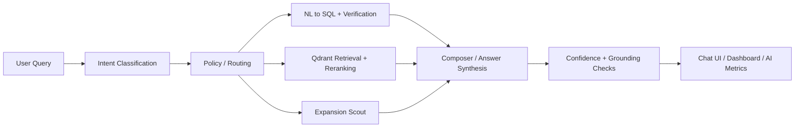

# Architecture and Agent State

## End-to-end flow

## Agent state model

The graph passes a structured state object between nodes. The most important keys are:

- `query`
  - original user question
- `intent`
  - high-level task classification
- `scope`
  - Highbury, Market, Hybrid, or General
- `filters`
  - resolved borough, neighborhood, month, year, listing, sentiment, and KPI constraints
- `plan`
  - route and execution mode
- `sql`
  - generated SQL, result rows, and table metadata
- `rag`
  - retrieved hits, reranked hits, confidence, citations, weak-evidence signal
- `result_bundle`
  - normalized payload used by the UI and evaluations
- `telemetry`
  - latency, token usage, reranker, and health diagnostics

## Tool selection rationale

- SQL
  - use when the question asks for structured metrics, rankings, counts, comparisons, or trends
- RAG
  - use when the question asks about review themes, complaints, praise, or qualitative evidence
- Hybrid
  - use when the answer should combine structured metrics and review evidence
- Expansion
  - use when the user asks where Highbury should grow next or requests market scouting

## Failure-mode map

- OpenAI unavailable
  - deterministic fallback summary if possible
- Qdrant unavailable
  - retrieval-backed runs degrade and the system should surface low confidence or abstain
- DuckDB unavailable
  - SQL and dashboard flows degrade, health endpoints report not ready
- Tavily unavailable
  - expansion sourcing degrades and health endpoints report not ready

## Interview framing

This architecture is intentionally constrained. The LLM does not decide everything freely. It routes into deterministic tools, then the system measures grounding, confidence, and latency before presenting the answer.
