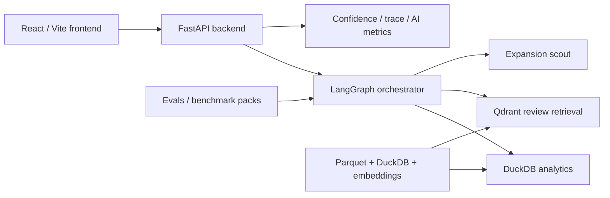

# Repository Map

This dossier is repo-grounded. The goal is to make interview answers traceable to code, data artifacts, and real request flows in `wtchtwr`.

## What This Repo Contains

`wtchtwr` combines:

- a FastAPI backend in [`backend/`](../../backend)
- a LangGraph-based agent/orchestrator in [`agent/`](../../agent)
- a React/Vite frontend in [`frontend/`](../../frontend)
- a DuckDB + Parquet analytics layer in [`db/`](../../db) and [`data/`](../../data)
- a Qdrant-backed review retrieval layer in [`vec/`](../../vec)
- an evaluation harness in [`evals/`](../../evals)

## Reconnaissance Note

### Key backend files

| File | Role |
| --- | --- |
| [`backend/main.py`](../../backend/main.py) | FastAPI app, conversations, streaming, summaries, exports, health, Slack bootstrapping |
| [`backend/ai_observability.py`](../../backend/ai_observability.py) | Confidence, trace payloads, AI metrics aggregation |
| [`backend/dashboard.py`](../../backend/dashboard.py) | Dashboard aggregation over cached parquet/DuckDB features |
| [`backend/dashboard_router.py`](../../backend/dashboard_router.py) | Dashboard endpoints |
| [`backend/data_explorer.py`](../../backend/data_explorer.py) | Structured query builder for Data Export |
| [`backend/data_trust.py`](../../backend/data_trust.py) | Data contracts and quality checks |
| [`backend/business_kpis.py`](../../backend/business_kpis.py) | Business KPI snapshot generation |
| [`backend/emailer.py`](../../backend/emailer.py) | SMTP email delivery |
| [`backend/exporter.py`](../../backend/exporter.py) | In-memory CSV export staging |
| [`backend/gdrive.py`](../../backend/gdrive.py) | Google Drive fallback for large exports |
| [`backend/models.py`](../../backend/models.py) | Pydantic payload models |
| [`backend/storage.py`](../../backend/storage.py) | Legacy file-based storage helpers; no longer the primary persistence path |

### Key frontend files

| File | Role |
| --- | --- |
| [`frontend/src/App.tsx`](../../frontend/src/App.tsx) | Route map and shell layout |
| [`frontend/src/pages/Chat.tsx`](../../frontend/src/pages/Chat.tsx) | Main chat UX, streaming, summary/export/email flows |
| [`frontend/src/components/ChatInput.tsx`](../../frontend/src/components/ChatInput.tsx) | Query input form |
| [`frontend/src/components/Message.tsx`](../../frontend/src/components/Message.tsx) | Answer rendering, tables, snippets, confidence, AI trace |
| [`frontend/src/pages/Dashboard.tsx`](../../frontend/src/pages/Dashboard.tsx) | Dashboard with map/charts |
| [`frontend/src/pages/DataExport.tsx`](../../frontend/src/pages/DataExport.tsx) | Data Explorer / export workflow |
| [`frontend/src/pages/History.tsx`](../../frontend/src/pages/History.tsx) | Conversation archive |
| [`frontend/src/pages/AiMetrics.tsx`](../../frontend/src/pages/AiMetrics.tsx) | Benchmark dashboard and case inspection |
| [`frontend/src/lib/api.ts`](../../frontend/src/lib/api.ts) | Typed REST client |
| [`frontend/src/store/useChat.ts`](../../frontend/src/store/useChat.ts) | Zustand chat state |

### Key agent/orchestration files

| File | Role |
| --- | --- |
| [`agent/graph.py`](../../agent/graph.py) | Real orchestrator: ingress, intent, routing, tool execution, compose, egress |
| [`agent/types.py`](../../agent/types.py) | `GraphState` and state bridge helpers |
| [`agent/intents.py`](../../agent/intents.py) | Intent classification and filter extraction |
| [`agent/policy.py`](../../agent/policy.py) | Entity normalization, plan selection, route decision |
| [`agent/nl2sql_llm.py`](../../agent/nl2sql_llm.py) | NL-to-SQL generation, validation, repair, execution |
| [`agent/vector_qdrant.py`](../../agent/vector_qdrant.py) | Retrieval, filters, reranking, evidence summary |
| [`agent/compose.py`](../../agent/compose.py) | Final answer synthesis and deterministic fallback |
| [`agent/portfolio_triage.py`](../../agent/portfolio_triage.py) | Triage workflow |
| [`agent/expansion_scout.py`](../../agent/expansion_scout.py) | Expansion scout workflow |
| [`agent/slack/bot.py`](../../agent/slack/bot.py) | Slack adapter that reuses backend conversation APIs |
| [`agent/config.py`](../../agent/config.py) | Config and environment defaults |

### Key evaluation files

| File | Role |
| --- | --- |
| [`evals/runner.py`](../../evals/runner.py) | Benchmark executor and assertion engine |
| [`evals/interview_summary.py`](../../evals/interview_summary.py) | Interview-ready rollups |
| [`evals/benchmarks.local.json`](../../evals/benchmarks.local.json) | Tuned regression pack |
| [`evals/benchmarks.holdout.json`](../../evals/benchmarks.holdout.json) | Holdout/generalization pack |
| [`evals/benchmarks.adversarial.json`](../../evals/benchmarks.adversarial.json) | Adversarial pack |
| [`evals/benchmarks.blind.sample.json`](../../evals/benchmarks.blind.sample.json) | Blind starter template, not a full blind suite |
| [`evals/error_taxonomy.md`](../../evals/error_taxonomy.md) | Failure categories |
| [`evals/review_sheet.template.csv`](../../evals/review_sheet.template.csv) | Human review sheet |

### Key data/schema files

| File or directory | Role |
| --- | --- |
| [`db/airbnb.duckdb`](../../db/airbnb.duckdb) | Structured analytics database |
| [`data/clean/`](../../data/clean) | Clean parquet sources |
| [`vec/airbnb_reviews/`](../../vec/airbnb_reviews) | Embeddings and metadata artifacts |
| [`scripts/rebuild_review_vectors.py`](../../scripts/rebuild_review_vectors.py) | Rebuilds vector store from review data |
| [`scripts/data_quality_report.py`](../../scripts/data_quality_report.py) | Generates data trust report |
| [`docs/data_dictionary.md`](../data_dictionary.md) | Business field definitions |
| [`docs/data_lineage.md`](../data_lineage.md) | Data lineage |

### Key deployment/config files

| File | Role |
| --- | --- |
| [`requirements.txt`](../../requirements.txt) | Python dependency set |
| [`frontend/package.json`](../../frontend/package.json) | Frontend dependency set |
| [`frontend/tailwind.config.js`](../../frontend/tailwind.config.js) | Tailwind config |
| [`frontend/postcss.config.js`](../../frontend/postcss.config.js) | PostCSS config |
| [`.env.example`](../../.env.example) | Runtime env template |
| [`agent/config.py`](../../agent/config.py) | Env-driven runtime config |

## Repo-Level Architecture

## Reading Order For Interview Prep

If you only read ten things before the interview, use this order:

1. [`README.md`](../../README.md)
2. [`docs/architecture.md`](../architecture.md)
3. [`agent/graph.py`](../../agent/graph.py)
4. [`backend/main.py`](../../backend/main.py)
5. [`agent/nl2sql_llm.py`](../../agent/nl2sql_llm.py)
6. [`agent/vector_qdrant.py`](../../agent/vector_qdrant.py)
7. [`evals/runner.py`](../../evals/runner.py)
8. [`frontend/src/pages/Chat.tsx`](../../frontend/src/pages/Chat.tsx)
9. [`frontend/src/components/Message.tsx`](../../frontend/src/components/Message.tsx)
10. [`frontend/src/pages/AiMetrics.tsx`](../../frontend/src/pages/AiMetrics.tsx)

## Honest Scope Notes

- There is **no full IaC / deployment manifest layer** in the repo. The runtime story is local env + local Docker + app startup.
- [`backend/storage.py`](../../backend/storage.py) still exists, but the current web app persists conversations through DuckDB tables managed in [`backend/main.py::ensure_schema`](../../backend/main.py).
- The benchmark story is strong for a portfolio project, but the blind evaluation artifact is only a **starter sample**, not a mature untouched blind set.
- The graph includes defensive patch logic in [`agent/graph.py::_compose_node`](../../agent/graph.py), especially around hybrid fusion. That is worth acknowledging as real iterative hardening rather than pretending the architecture is perfectly clean.

