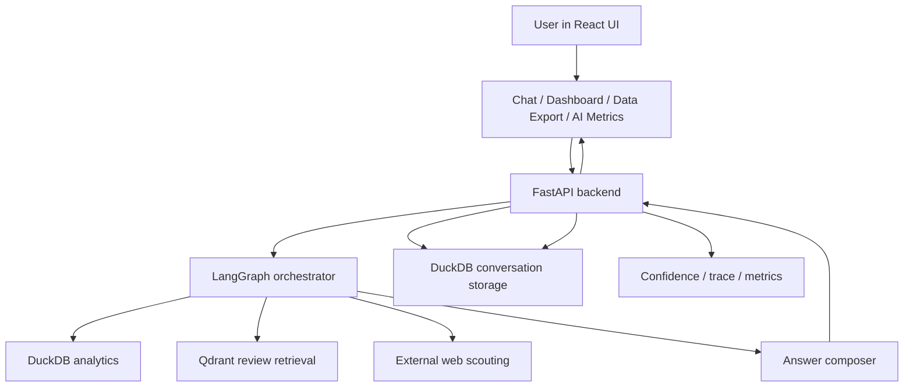

# System Overview

## Plain-English Version

`wtchtwr` is a decision-support copilot for short-term rental operators. A user can ask:

- "Average occupancy for my Highbury listings in Manhattan"
- "What are guests complaining about in Midtown?"
- "Compare our pricing to the market and explain likely review drivers"
- "Which neighborhoods should Highbury consider next?"

The system answers those questions by combining:

- structured analytics from DuckDB
- unstructured review retrieval from Qdrant
- a graph-based orchestrator that decides which path to use
- a frontend that shows not just the answer, but also tables, trace, and confidence

Repo anchors:

- product framing: [`README.md`](../../README.md)
- simplified architecture: [`docs/architecture.md`](../architecture.md)
- real request entry: [`backend/main.py`](../../backend/main.py)
- real orchestrator: [`agent/graph.py`](../../agent/graph.py)

## Business Problem It Solves

The repo is built around one central problem: operational rental data is fragmented across:

- structured portfolio metrics
- qualitative guest reviews
- neighborhood expansion signals

The system reduces that fragmentation by letting users ask one question instead of manually:

- writing SQL
- opening dashboards
- scanning reviews
- stitching together market notes

This value framing is explicit in [`README.md`](../../README.md) and reinforced by [`backend/business_kpis.py::build_business_kpi_snapshot`](../../backend/business_kpis.py).

## User Personas Supported By Code

| Persona | Need | Repo evidence |
| --- | --- | --- |
| Operations manager | weak listings, guest issues, QA gaps | [`agent/portfolio_triage.py::run_portfolio_triage`](../../agent/portfolio_triage.py) |
| Revenue manager | ADR / occupancy / revenue vs market | [`agent/nl2sql_llm.py`](../../agent/nl2sql_llm.py), [`frontend/src/pages/Dashboard.tsx`](../../frontend/src/pages/Dashboard.tsx) |
| Expansion lead | future neighborhoods with external signals | [`agent/expansion_scout.py::exec_expansion_scout`](../../agent/expansion_scout.py) |
| Analyst / operator | chat, summarize, export, email findings | [`backend/main.py`](../../backend/main.py), [`frontend/src/pages/Chat.tsx`](../../frontend/src/pages/Chat.tsx), [`frontend/src/pages/DataExport.tsx`](../../frontend/src/pages/DataExport.tsx) |

## Why An Agentic Architecture Fits This Repo

### Interview language

An agentic architecture makes sense because the application has to choose among multiple tools and workflows:

- SQL for structured truth
- retrieval for review evidence
- hybrid fusion for metric + narrative questions
- a triage workflow for operational diagnosis
- an expansion workflow for external market signals

A single prompt would be much harder to constrain, debug, or evaluate.

### Implementation language

This repo is "agentic" because it does all of the following in code:

- maintains structured state via [`agent/types.py::GraphState`](../../agent/types.py)
- classifies intent with [`agent/intents.py::classify_intent`](../../agent/intents.py)
- normalizes entities with [`agent/policy.py::resolve_entities`](../../agent/policy.py)
- plans a route with [`agent/policy.py::plan_steps`](../../agent/policy.py)
- conditionally invokes different tools inside [`agent/graph.py::build_graph`](../../agent/graph.py)
- can run SQL and RAG concurrently in [`agent/graph.py::_hybrid_fusion_node`](../../agent/graph.py)
- computes confidence and abstention signals in [`backend/ai_observability.py`](../../backend/ai_observability.py)
- persists conversation and thread context in [`backend/main.py`](../../backend/main.py)

That is materially different from "one LLM call with a lot of instructions."

## What “Agentic” Means Here Specifically

In this repo, "agentic" means a **constrained orchestrator** with explicit routing and tool use.

### What it does

- classify question type
- extract business filters
- choose one execution mode
- run the selected tool path
- normalize outputs into one bundle
- synthesize an answer
- attach confidence and trace metadata

### What it does not do

- no arbitrary tool marketplace
- no long-horizon autonomous planning across many systems
- no recursive self-reflection loop
- no open-ended action-taking outside prewired workflows

That narrower design is a deliberate tradeoff toward controllability.

## Top-Level Architecture

## Main Subsystems And Interactions

| Subsystem | Main files | Responsibility |
| --- | --- | --- |
| Frontend shell | [`frontend/src/App.tsx`](../../frontend/src/App.tsx) | Routes users to chat, dashboard, history, data export, AI metrics |
| Chat experience | [`frontend/src/pages/Chat.tsx`](../../frontend/src/pages/Chat.tsx), [`frontend/src/components/Message.tsx`](../../frontend/src/components/Message.tsx) | Sends prompts, handles streaming, renders answers/trace/confidence |
| API + persistence | [`backend/main.py`](../../backend/main.py) | Conversations, messages, summaries, export/email, health, AI metrics |
| Orchestrator | [`agent/graph.py`](../../agent/graph.py) | Stateful node graph and routing |
| Intent/policy | [`agent/intents.py`](../../agent/intents.py), [`agent/policy.py`](../../agent/policy.py) | Intent, scope, filters, plan mode |
| SQL toolchain | [`agent/nl2sql_llm.py`](../../agent/nl2sql_llm.py) | SQL generation, validation, repair, execution |
| Retrieval toolchain | [`agent/vector_qdrant.py`](../../agent/vector_qdrant.py) | Embeddings search, filters, reranking, evidence summary |
| Domain workflows | [`agent/portfolio_triage.py`](../../agent/portfolio_triage.py), [`agent/expansion_scout.py`](../../agent/expansion_scout.py) | Triage and external-signal scouting |
| Evaluation layer | [`evals/runner.py`](../../evals/runner.py), [`evals/interview_summary.py`](../../evals/interview_summary.py) | Accuracy, latency, benchmark reporting |

## High-Level Request Lifecycle

1. User types into the React chat UI.
2. Frontend posts to `POST /api/conversations/{id}/messages`.
3. Backend persists the user message and recent history.
4. Backend invokes the LangGraph orchestrator.
5. Graph runs ingress, guardrails, intent classification, entity resolution, and planning.
6. Graph routes to SQL, RAG, hybrid, triage, or expansion.
7. Tool outputs are normalized into `result_bundle`.
8. Composer builds the final grounded answer.
9. Backend adds confidence and trace payloads.
10. Assistant message is persisted and returned to the frontend.
11. Frontend renders answer text, tables, snippets, confidence, and AI trace.

This lifecycle is implemented primarily across:

- [`frontend/src/pages/Chat.tsx`](../../frontend/src/pages/Chat.tsx)
- [`backend/main.py`](../../backend/main.py)
- [`agent/graph.py`](../../agent/graph.py)
- [`backend/ai_observability.py`](../../backend/ai_observability.py)

## Why The Design Likely Exists

The codebase consistently prefers:

- explicit state over hidden prompt context
- deterministic tool routes over pure LLM free-form answers
- local analytics stack (DuckDB + Parquet) over warehouse dependencies
- lightweight retrieval (SentenceTransformer + Qdrant) over heavier enterprise stacks
- benchmark-driven iteration over anecdotal demos

Likely reasons:

- fast local development
- reproducible interview/demo environment
- easier debugging
- clearer evaluation boundaries

## Alternatives The Repo Could Have Used

| Problem | Current choice | Plausible alternative | Why the current choice is understandable |
| --- | --- | --- | --- |
| Orchestration | LangGraph | one big prompt, plain Python router, Semantic Kernel | LangGraph makes routing/state explicit |
| Structured analytics | DuckDB | Postgres, BigQuery, Snowflake | DuckDB is excellent for local analytics demos |
| Vector retrieval | Qdrant | Chroma, pgvector, Azure AI Search | Qdrant is lightweight and straightforward locally |
| Embeddings | `all-MiniLM-L6-v2` | OpenAI embeddings, BGE, E5 | cheap, local, good enough for review retrieval |
| Frontend | React/Vite | Next.js, Streamlit | React gives more control over trace/metrics UX |

## Technology Choices And Why This Stack Makes Sense

| Technology | Used where | What it does here | Why it likely was chosen | Reasonable alternative |
| --- | --- | --- | --- | --- |
| FastAPI | [`backend/main.py`](../../backend/main.py) | API layer and streaming responses | clean Python API surface, easy JSON + SSE-style streaming | Flask, Django, Node/Express |
| React | [`frontend/src`](../../frontend/src) | main frontend framework | flexible SPA for multiple product surfaces | Next.js, Streamlit |
| Tailwind CSS | [`frontend/src/index.css`](../../frontend/src/index.css) | utility-first styling | fast iteration, consistent styling | CSS modules, styled-components |
| Deck.gl | [`frontend/src/pages/Dashboard.tsx`](../../frontend/src/pages/Dashboard.tsx) | listing coverage map | better for many map points than simple DOM maps | Leaflet, Mapbox GL |
| LangGraph | [`agent/graph.py`](../../agent/graph.py) | stateful orchestration | explicit graph/state model | plain Python router, Semantic Kernel |
| LangChain ecosystem imports | in agent/compose/expansion support | auxiliary model/document utilities | ecosystem convenience without giving up app-level control | direct SDK-only approach |
| DuckDB | SQL path, dashboard, explorer | local analytical execution | excellent for Parquet-scale local analytics | Postgres, warehouse, Fabric |
| Qdrant | [`agent/vector_qdrant.py`](../../agent/vector_qdrant.py) | vector retrieval | simple OSS vector DB for local dev | Azure AI Search, pgvector, Chroma |
| SentenceTransformer MiniLM | [`scripts/rebuild_review_vectors.py`](../../scripts/rebuild_review_vectors.py) | local embeddings | inexpensive and local | OpenAI embeddings, BGE |
| OpenAI API | compose, SQL, expansion synthesis | language reasoning and synthesis | straightforward high-quality model access | Azure OpenAI, Anthropic, local models |
| Docker | local Qdrant runtime | dependency isolation | simple local service bring-up | native install, cloud service |
| Custom eval harness | [`evals/`](../../evals) | benchmarking and reporting | tightly matched to repo behavior | LangSmith-style evals, Azure ML evals |
| Custom observability layer | [`backend/ai_observability.py`](../../backend/ai_observability.py) | confidence, trace, benchmark payloads | project-specific explainability needs | generic tracing SDK only |

## Strong Architectural Points

- explicit graph/state model
- deterministic separation between SQL, RAG, hybrid, triage, and expansion
- confidence + trace surfaced to users
- benchmark packs integrated into the product via `/api/ai/metrics`
- data contracts and trust tooling exist in the repo, not just marketing copy

## Weak Spots To Be Honest About

- The system is production-inspired, not fully productionized. There is no IaC/deployment stack in-repo.
- Some graph logic in [`agent/graph.py::_compose_node`](../../agent/graph.py) is visibly patchy, especially around hybrid result fusion.
- Expansion uses external HTTP fetch + parsing in [`agent/expansion_scout.py`](../../agent/expansion_scout.py), so it is less deterministic than SQL/RAG.
- [`backend/storage.py`](../../backend/storage.py) coexists with current DuckDB-backed persistence and reads like legacy tech debt.

## Interviewer May Ask

### “Why not one prompt?”

Because this repo has multiple evidence types and failure modes. SQL, review retrieval, portfolio triage, and expansion scouting are different tasks. The graph makes the route explicit and measurable.

### “What is the strongest architectural point?”

The strongest point is the separation between orchestration, deterministic tools, synthesis, and evaluation. The code does not rely on one opaque LLM call.
