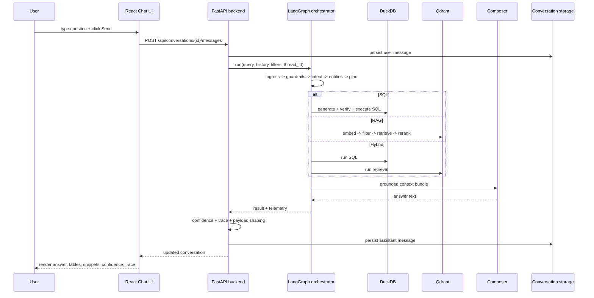

# End-to-End Query Lifecycle

This is the most important “walk me through it” document in the set. It traces what happens from user input to rendered answer using the actual code path.

## Plain-English Walkthrough

When a user sends a question, the frontend posts it to the FastAPI backend. The backend saves the user message, loads recent history, and invokes the LangGraph orchestrator. The graph classifies the question, extracts filters, chooses whether to use SQL, retrieval, hybrid fusion, triage, or expansion, runs the relevant tool path, builds a normalized result bundle, asks the composer to turn that into a user-facing answer, computes confidence and trace metadata, stores the assistant message, and returns the updated conversation. The frontend then renders the answer, any tables, retrieved snippets, confidence, and AI trace.

## Lifecycle Diagram

## 1. Frontend Captures The Query

The visible input box is [`frontend/src/components/ChatInput.tsx`](../../frontend/src/components/ChatInput.tsx). It only owns local text state and calls `onSend(text)` when submitted.

The actual chat send logic lives in [`frontend/src/pages/Chat.tsx::handleSend`](../../frontend/src/pages/Chat.tsx).

Why this split exists:

- `ChatInput` stays dumb and reusable
- `Chat.tsx` owns streaming, optimistic UI, pending assistant messages, summary/export/email controls

Potential failure points:

- empty prompt
- command-mode interception (`dashboard`, `slackbot`, `help`)
- network failure before stream opens

## 2. Frontend Sends The Request

The chat page uses direct `fetch` for streaming in [`frontend/src/pages/Chat.tsx::handleSend`](../../frontend/src/pages/Chat.tsx), posting to:

- `POST /api/conversations/{conversationId}/messages`

Body fields include:

- `content`
- `stream: true`
- `thread_id`
- `debug_thinking`

There is also a typed non-stream helper in [`frontend/src/lib/api.ts::sendMessage`](../../frontend/src/lib/api.ts), but the live chat page uses the streaming path directly.

Why:

- streaming gives token-by-token feedback
- the final payload still arrives as a full normalized conversation object

Potential failure points:

- response body missing
- malformed stream events
- stream ends without a final payload

## 3. Backend Validates The Request

The request lands in [`backend/main.py::post_message`](../../backend/main.py).

That function:

1. logs the payload
2. extracts the question from `query` or `content`
3. rejects empty questions with HTTP 400
4. reads optional runtime flags:
   - `tenant`
   - `user_filters`
   - `composer_enabled`
   - `stream`
   - `debug_thinking`

Why:

- validate at the API boundary before touching orchestration

Potential failure points:

- empty question
- malformed payload
- persistence failure before orchestration

## 4. Conversation History And Thread State Are Loaded

`post_message` calls [`backend/main.py::_record_user_message`](../../backend/main.py), which:

- fetches the conversation via `fetch_conversation(...)`
- inserts the user message with `insert_message(...)`
- maps the conversation to `thread_map` via `map_thread_to_conversation(...)`
- trims history with `trim_history(...)`

Conversation tables are created in [`backend/main.py::ensure_schema`](../../backend/main.py):

- `conversations`
- `messages`
- `exports_cache`
- `thread_map`

Why:

- the graph needs recent conversational context and a stable thread ID

Potential failure points:

- DuckDB lock/contention
- missing conversation row
- stale thread mapping

## 5. Backend Invokes The Orchestrator

For synchronous mode, [`backend/main.py::_execute_langgraph`](../../backend/main.py) calls [`agent/graph.py::run`](../../agent/graph.py).

For streaming mode, [`backend/main.py::_stream_response`](../../backend/main.py) calls [`agent/graph.py::stream`](../../agent/graph.py).

Both paths run the same graph logic.

Inputs passed into the agent include:

- `query`
- `tenant`
- `user_filters`
- `history`
- `thread_id`
- `composer_enabled`
- `debug_thinking`

## 6. Ingress Node Bootstraps State

The first graph node is [`agent/graph.py::_ingress_node`](../../agent/graph.py).

It:

- blocks extremely long queries early
- ensures `raw_input` contains query/tenant/history/debug flags
- merges existing thread memory
- calls legacy ingress helpers
- converts legacy state into `GraphState`

Why:

- standardize state shape before routing/tool execution

Potential failure points:

- stale memory polluting a new request
- oversimplified length guard blocking legitimate verbose prompts

## 7. Guardrails Run Before Expensive Work

[`agent/graph.py::_guardrails_node`](../../agent/graph.py) delegates to guardrail logic in [`agent/guards.py::guardrails`](../../agent/guards.py).

`_guardrail_route(...)` can send the graph directly to `egress`.

Why:

- fail early before SQL generation, retrieval, or composition

Potential failure points:

- false positives / false negatives in blocking

## 8. Intent Classification Happens

[`agent/graph.py::_classify_intent_node`](../../agent/graph.py) calls [`agent/intents.py::classify_intent`](../../agent/intents.py).

This stage determines:

- intent
- scope
- rough filters

Examples of handled intents:

- greeting / thanks / smalltalk
- expansion scout
- portfolio triage
- sentiment review question
- structured SQL question
- compare / hybrid question

It also extracts:

- borough
- neighborhood
- month
- year
- listing ID
- `is_highbury`
- sentiment label

Why:

- route selection depends on understanding question type and scope first

Potential failure points:

- ambiguous prompts
- compare prompts misclassified as pure sentiment
- missed geography or portfolio ownership cues

## 9. Entities And Filters Are Normalized

[`agent/graph.py::_resolve_entities_node`](../../agent/graph.py) calls [`agent/policy.py::resolve_entities`](../../agent/policy.py).

This normalizes:

- borough casing
- month names to abbreviations
- year types
- `is_highbury`
- sentiment labels

Why:

- SQL and Qdrant filtering should operate on canonical values

Potential failure points:

- over-normalization removing nuance
- missing support for unusual user wording

## 10. The Planner Chooses A Route

[`agent/graph.py::_plan_steps_node`](../../agent/graph.py) calls [`agent/policy.py::plan_steps`](../../agent/policy.py).

This sets a `plan` that includes:

- `mode`
- `policy`
- `sql_table`
- `top_k`
- `use_sentiment`

Conditional routing is then handled by [`agent/policy.py::choose_path`](../../agent/policy.py), which is wired into [`agent/graph.py::build_graph`](../../agent/graph.py).

Possible routes:

- `nl2sql`
- `rag`
- `hybrid`
- `portfolio_triage`
- `expansion_scout`

Why:

- this is the control plane; it keeps the rest of the system deterministic

Potential failure points:

- wrong policy chosen for ambiguous compare prompts
- triage intent overridden by generic SQL/RAG heuristics

## 11. One Of The Execution Paths Runs

### SQL path

[`agent/graph.py::_plan_to_sql_node`](../../agent/graph.py) calls [`agent/nl2sql_llm.py::plan_to_sql_llm`](../../agent/nl2sql_llm.py).

That path:

- builds a schema-aware prompt
- asks the model for SQL
- cleans and verifies SQL
- repairs it if needed
- executes on DuckDB
- stores rows, columns, markdown table, and summary in `state.sql`

### RAG path

[`agent/graph.py::_exec_rag_node`](../../agent/graph.py) calls:

- [`agent/vector_qdrant.py::exec_rag`](../../agent/vector_qdrant.py)
- then [`agent/vector_qdrant.py::summarize_hits`](../../agent/vector_qdrant.py)

That path:

- embeds the query
- searches Qdrant
- applies metadata filters
- reranks hits
- deduplicates
- creates a retrieval summary

### Hybrid path

[`agent/graph.py::_hybrid_fusion_node`](../../agent/graph.py) runs SQL and RAG concurrently using `ThreadPoolExecutor`, then merges their outputs into one `result_bundle`.

### Portfolio triage path

[`agent/graph.py::_portfolio_triage_node`](../../agent/graph.py) calls [`agent/portfolio_triage.py::run_portfolio_triage`](../../agent/portfolio_triage.py).

### Expansion path

[`agent/graph.py::_expansion_scout_node`](../../agent/graph.py) calls [`agent/expansion_scout.py::exec_expansion_scout`](../../agent/expansion_scout.py).

## 12. Intermediate Results Are Normalized

Before final composition, [`agent/graph.py::_compose_node`](../../agent/graph.py) prepares a common `result_bundle`.

Typical bundle fields:

- `policy`
- `scope`
- `filters`
- `rows`
- `columns`
- `aggregates`
- `sql`
- `markdown_table`
- `rag_snippets`
- `summary`
- `portfolio_triage`
- `expansion_report`

Why:

- the composer should not need to understand each tool’s native output format

Potential failure points:

- hybrid branch drops SQL rows or RAG snippets
- patch blocks mask deeper shape inconsistencies

## 13. Final Answer Is Composed

[`agent/graph.py::_compose_node`](../../agent/graph.py) eventually calls [`agent/compose.py::compose_answer`](../../agent/compose.py). If composition is disabled or fails, it falls back to [`agent/compose.py::fallback_text`](../../agent/compose.py).

The composer receives:

- policy
- filters
- SQL preview
- review summary/snippets
- triage context
- expansion sources

Why:

- tool outputs are not user-ready; they need grounded narration

Potential failure points:

- SQL leakage into final prose
- weak evidence overstated as broad truth

## 14. Confidence, Trace, And Grounding Metadata Are Attached

After the graph returns, [`backend/main.py::build_assistant_payload`](../../backend/main.py) computes:

- `confidence` via [`backend/ai_observability.py::build_confidence_payload`](../../backend/ai_observability.py)
- `trace` via [`backend/ai_observability.py::build_trace_payload`](../../backend/ai_observability.py)

If abstention is recommended, `build_assistant_payload(...)` rewrites the summary into a safer response and sets `abstained = True`.

Why:

- this is the repo’s main anti-hallucination UX layer

## 15. The Result Is Persisted

[`backend/main.py::_finalize_assistant_message`](../../backend/main.py):

- chooses final content
- strips SQL if it leaked
- writes `answer_text` and `result_bundle.summary`
- builds assistant payload
- inserts the assistant message into `messages`
- fetches the updated conversation

Why:

- the persisted conversation should match the final response object shown in the UI

## 16. The Frontend Renders The Response

In streaming mode:

- [`frontend/src/pages/Chat.tsx::handleSend`](../../frontend/src/pages/Chat.tsx) reads event chunks
- token events are appended into a pending assistant bubble
- the final payload replaces/normalizes the local pending state

Rendering happens in [`frontend/src/components/Message.tsx`](../../frontend/src/components/Message.tsx), which shows:

- answer markdown
- tables
- review snippets
- confidence
- AI trace
- sentiment analytics

Shared chat state is handled in [`frontend/src/store/useChat.ts`](../../frontend/src/store/useChat.ts).

Potential failure points:

- streaming tokens diverge from final payload
- message payload missing keys expected by `Message.tsx`
- large tables overwhelm the UI

## Critical Failure Points To Know

| Stage | Likely risk |
| --- | --- |
| Frontend streaming | partial tokens without final payload |
| Persistence | DuckDB contention / mode mismatch |
| Intent/policy | wrong route for ambiguous compare or triage prompts |
| NL-to-SQL | valid-looking but semantically wrong SQL |
| Retrieval | weak evidence or wrong metadata slice |
| Hybrid fusion | one branch overwriting the other |
| Composition | grounded data restated too confidently |

## Interviewer May Ask

### “Where is the single most important function in the lifecycle?”

If you had to pick one, it is [`agent/graph.py::_compose_node`](../../agent/graph.py), because that is where all upstream routing/tool work is normalized and turned into the final answer context.

### “Where would you debug a wrong answer first?”

Start in this order:

1. [`backend/main.py::post_message`](../../backend/main.py)
2. [`agent/intents.py::classify_intent`](../../agent/intents.py)
3. [`agent/policy.py::plan_steps`](../../agent/policy.py)
4. [`agent/nl2sql_llm.py`](../../agent/nl2sql_llm.py) or [`agent/vector_qdrant.py`](../../agent/vector_qdrant.py)
5. [`agent/graph.py::_compose_node`](../../agent/graph.py)
6. [`backend/ai_observability.py`](../../backend/ai_observability.py)

