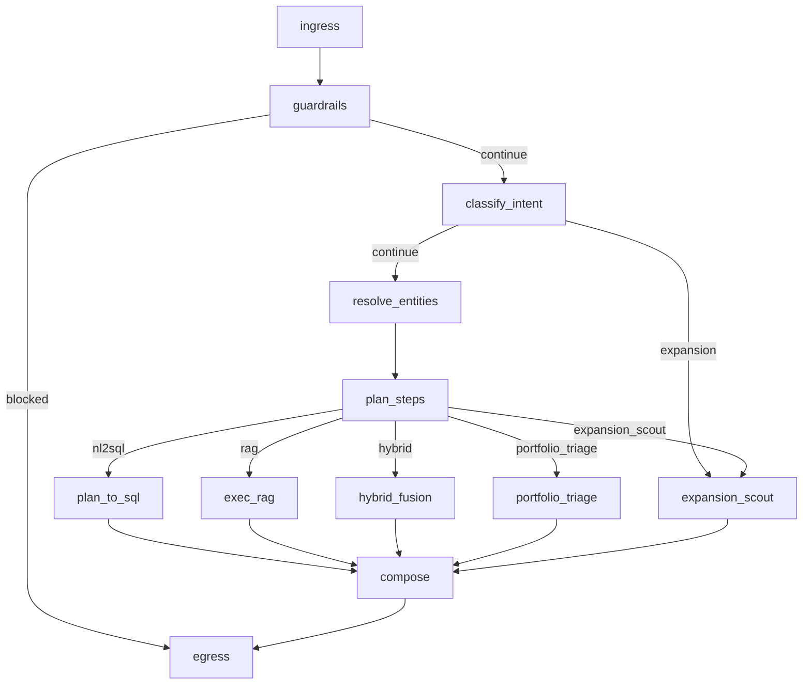

# Orchestrator And Graph

## Plain-English Version

The orchestrator is the brain of the system. Instead of sending the user question straight to one LLM prompt, the repo moves a structured state object through a graph of nodes. Each node has one job: bootstrap state, classify intent, normalize filters, choose a plan, run a tool, compose the answer, or package the final result.

The benefit is control. The tradeoff is complexity.

Repo anchors:

- graph definition: [`agent/graph.py`](../../agent/graph.py)
- state model: [`agent/types.py`](../../agent/types.py)
- planner/routing: [`agent/policy.py`](../../agent/policy.py)

## GraphState: What The Orchestrator Passes Around

The state object is defined in [`agent/types.py::GraphState`](../../agent/types.py).

Important fields:

| Field | Purpose |
| --- | --- |
| `query` | user question |
| `tenant` | tenant / caller context |
| `intent` | classified intent label |
| `scope` | portfolio/market/hybrid/general scope |
| `filters` | normalized extracted filters |
| `plan` | route decision and policy |
| `sql` | SQL path output |
| `rag` | retrieval path output |
| `result_bundle` | normalized bundle for composition |
| `telemetry` | latencies, usage, degraded reasons |
| `memory` | thread-level remembered context |
| `history` | recent conversation turns |
| `extras` | side-channel fields like `answer_text`, `portfolio_triage` |
| `thinking` | optional debug trace entries |

Why this matters:

- interviewer can see that state is explicit
- each node can be reasoned about independently
- debugging is easier than one opaque prompt

## State Bridging And Legacy Compatibility

The orchestrator is not fully “pure GraphState.” It bridges between legacy dict-style state and `GraphState` using:

- [`agent/types.py::state_to_graph`](../../agent/types.py)
- [`agent/types.py::graph_to_state`](../../agent/types.py)

Likely reason:

- the repo appears to have evolved from older dict-based orchestration into LangGraph

Tradeoff:

- faster migration
- more compatibility glue
- more risk of duplicated or drifting fields

## Node Order In The Real Graph

`build_graph()` in [`agent/graph.py::build_graph`](../../agent/graph.py) wires the graph like this:

## Node-By-Node Walkthrough

### 1. `_ingress_node`

File: [`agent/graph.py::_ingress_node`](../../agent/graph.py)

What it does:

- rejects very long queries
- injects query/tenant/debug flags into `raw_input`
- merges history and user filters
- merges existing memory into the current request
- converts legacy ingress output into `GraphState`

Why it exists:

- create a clean, normalized starting state

### 2. `_guardrails_node`

File: [`agent/graph.py::_guardrails_node`](../../agent/graph.py)

What it does:

- delegates to legacy guardrail logic
- marks `guardrail_blocked`

Why it exists:

- block unsupported or malformed requests before expensive work

### 3. `_classify_intent_node`

File: [`agent/graph.py::_classify_intent_node`](../../agent/graph.py)

What it does:

- calls [`agent/intents.py::classify_intent`](../../agent/intents.py)
- stores an `intent_hint` in telemetry
- persists `last_intent` and `last_scope` into memory

Why it exists:

- later routing depends on both intent and scope

### 4. `_resolve_entities_node`

File: [`agent/graph.py::_resolve_entities_node`](../../agent/graph.py)

What it does:

- calls [`agent/policy.py::resolve_entities`](../../agent/policy.py)
- persists `last_filters` into memory

### 5. `_plan_steps_node`

File: [`agent/graph.py::_plan_steps_node`](../../agent/graph.py)

What it does:

- calls [`agent/policy.py::plan_steps`](../../agent/policy.py)
- persists `last_plan`

Why it exists:

- separate “what the question means” from “which tool path to run”

### 6. `_plan_to_sql_node`

File: [`agent/graph.py::_plan_to_sql_node`](../../agent/graph.py)

What it does:

- calls [`agent/nl2sql_llm.py::plan_to_sql_llm`](../../agent/nl2sql_llm.py)
- stores a small SQL memory summary

### 7. `_exec_rag_node`

File: [`agent/graph.py::_exec_rag_node`](../../agent/graph.py)

What it does:

- calls legacy retrieval execution + summarization
- stores `last_rag` summary and a small hit sample in memory

### 8. `_expansion_scout_node`

File: [`agent/graph.py::_expansion_scout_node`](../../agent/graph.py)

What it does:

- calls [`agent/expansion_scout.py::exec_expansion_scout`](../../agent/expansion_scout.py)

### 9. `_hybrid_fusion_node`

File: [`agent/graph.py::_hybrid_fusion_node`](../../agent/graph.py)

What it does:

- checks if hybrid is truly requested
- runs SQL and RAG concurrently using `ThreadPoolExecutor`
- merges both states with `_merge_states(...)`
- records fusion telemetry
- assembles a fused result bundle

Why it exists:

- hybrid questions are a first-class workflow in this repo, not a post-hoc prompt trick

Tradeoff:

- more complexity around merging and state recovery

### 10. `_portfolio_triage_node`

File: [`agent/graph.py::_portfolio_triage_node`](../../agent/graph.py)

What it does:

- runs [`agent/portfolio_triage.py::run_portfolio_triage`](../../agent/portfolio_triage.py)

### 11. `_compose_node`

File: [`agent/graph.py::_compose_node`](../../agent/graph.py)

What it does:

- prepares and patches the bundle
- special-cases conversational intents
- recovers missing SQL table data for hybrid flows
- injects markdown tables when missing
- delegates to `_compose_legacy(...)`
- persists `last_answer` and a compose thinking step

Why it exists:

- unify all branches into one user-facing answer context

Honest note:

This is one of the messier parts of the repo. It contains several compatibility and recovery blocks that were clearly added during iterative hardening.

### 12. `_egress_node`

File: [`agent/graph.py::_egress_node`](../../agent/graph.py)

What it does:

- delegates to legacy egress
- attaches telemetry, state snapshot, memory, sql, rag
- stores a `conversation_trace` block in memory

## Memory Model

The graph uses an in-memory checkpoint store:

- [`agent/graph.py::_memory_store`](../../agent/graph.py)
- backed by `MemorySaver`
- accessed through `get_memory_context(...)` and `save_memory_context(...)`

What is stored:

- last query
- last intent
- last scope
- last filters
- last plan
- last SQL summary
- last RAG summary
- last answer
- conversation trace

Why this design likely exists:

- gives thread-local short memory without requiring another persistence service

Limitations:

- process-local only
- not durable across restarts
- not suitable for scaled multi-instance deployment as-is

## Tool Invocation Model

The graph does not use an open-ended tool-calling agent that picks arbitrary tools. Tool invocation is route-driven:

- SQL -> [`agent/nl2sql_llm.py`](../../agent/nl2sql_llm.py)
- RAG -> [`agent/vector_qdrant.py`](../../agent/vector_qdrant.py)
- expansion -> [`agent/expansion_scout.py`](../../agent/expansion_scout.py)
- triage -> [`agent/portfolio_triage.py`](../../agent/portfolio_triage.py)

Why this choice is sensible:

- easier to debug
- easier to evaluate
- easier to constrain

## Fallback And Degraded Behavior

Important fallback points:

- compose failure -> [`agent/compose.py::fallback_text`](../../agent/compose.py)
- RAG contradiction / “no reviews” despite hits -> `_needs_rag_fallback(...)` and `_rag_fallback_answer(...)` in [`agent/graph.py`](../../agent/graph.py)
- missing grounded portfolio evidence -> `_should_abstain_for_missing_portfolio_evidence(...)`
- backend-level abstention rewrite -> [`backend/main.py::build_assistant_payload`](../../backend/main.py)

This is one of the stronger design choices in the repo: it tries not to let weak evidence silently become confident prose.

## Why Use A Graph Instead Of One Big Prompt

### Benefits

- explicit state transitions
- deterministic route control
- per-branch telemetry
- better hybrid execution
- easier degraded mode handling
- easier evaluation by stage

### Tradeoffs

- more moving parts
- more state-shape complexity
- legacy bridge code
- patchiness in compose/fusion logic

## Strong Points To Highlight

- explicit `GraphState`
- conditional route selection
- parallel hybrid execution
- short-term memory separated from durable conversation storage
- fallback and abstention logic integrated into orchestration

## Weak Spots To Admit

- `_compose_node` is doing a lot of defensive recovery work
- memory is in-process only
- some nodes still rely on legacy helper flow instead of a fully graph-native implementation

