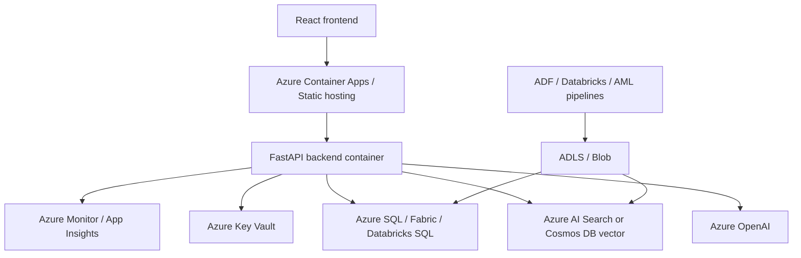

# Azure Architecture Mapping

This section maps the **current repo architecture** to plausible Azure / Microsoft-native replacements.

Important honesty note:

- these Azure services are **not implemented in the repo today**
- this is an architecture translation exercise from current responsibilities to Microsoft-native options

## Current-To-Azure Mapping Table

| Current repo component | What it does today | Azure / Microsoft-native option | Why it fits | When I might keep the current option |
| --- | --- | --- | --- | --- |
| OpenAI calls in [`agent/compose.py`](../../agent/compose.py), [`agent/nl2sql_llm.py`](../../agent/nl2sql_llm.py), [`agent/expansion_scout.py`](../../agent/expansion_scout.py) | chat completion and synthesis | Azure OpenAI | enterprise auth, governance, region controls | local demo/dev speed or when avoiding cloud lock-in |
| LangGraph in [`agent/graph.py`](../../agent/graph.py) | app-layer orchestration | Azure AI Foundry Agent Service, or Semantic Kernel, or keep app-layer orchestration | managed agent patterns or Microsoft ecosystem alignment | when you want maximum code-level control and deterministic routing |
| Qdrant in [`agent/vector_qdrant.py`](../../agent/vector_qdrant.py) | vector retrieval over reviews | Azure AI Search vector search, Azure Cosmos DB vector search, or Azure Database for PostgreSQL + pgvector | tighter cloud integration, managed ops | Qdrant is still a strong choice when local portability and OSS control matter |
| DuckDB in [`agent/nl2sql_llm.py`](../../agent/nl2sql_llm.py), [`backend/dashboard.py`](../../backend/dashboard.py) | local analytical execution | Azure SQL, Fabric warehouse, Synapse serverless SQL, Databricks SQL, or Microsoft Fabric | scale, concurrency, managed access | DuckDB remains great for local analytics and demo portability |
| FastAPI in [`backend/main.py`](../../backend/main.py) | API layer | Azure Container Apps, App Service, or AKS | easy container deployment and scaling | local/dev simplicity or small single-node deployment |
| Local Docker + manual Qdrant startup | local service runtime | Azure Container Apps + Azure Container Registry | managed container hosting | local demo environments |
| Parquet in [`data/clean`](../../data/clean) | raw/clean analytical artifacts | Azure Blob Storage or ADLS Gen2 | durable object storage, ETL-friendly | local-first portfolio demo |
| Data quality scripts in [`scripts/data_quality_report.py`](../../scripts/data_quality_report.py) | trust checks | Azure Data Factory / Databricks jobs / Azure ML pipelines | scheduled validation pipelines | small offline local workflows |
| Evaluation in [`evals/`](../../evals) | benchmark execution and reporting | Azure ML evaluation pipelines, custom benchmark jobs, App Insights dashboards | managed experiment tracking and automation | local scripted evals are fine for a portfolio project |
| SMTP in [`backend/emailer.py`](../../backend/emailer.py) | email delivery | Azure Communication Services Email or Microsoft Graph mail workflows | managed email/send identity | SMTP is simpler for local testing |
| Google Drive export fallback in [`backend/gdrive.py`](../../backend/gdrive.py) | large-file sharing | Azure Blob SAS links or SharePoint / OneDrive integration | more Microsoft-native sharing path | if Google Drive is already part of the team workflow |

## Service-By-Service Mapping

## 1. LLM Serving

### Current repo

- OpenAI SDK usage in:
  - [`agent/compose.py`](../../agent/compose.py)
  - [`agent/nl2sql_llm.py`](../../agent/nl2sql_llm.py)
  - [`agent/expansion_scout.py`](../../agent/expansion_scout.py)

### Azure option

- Azure OpenAI

### Why it fits

- same broad usage pattern: chat completions + model selection
- better enterprise network/control story
- easier to combine with Azure identity and network boundaries

### Tradeoff

- Azure model availability and deployment management add ops overhead

## 2. Agent Orchestration

### Current repo

- LangGraph in [`agent/graph.py`](../../agent/graph.py)

### Azure / Microsoft options

- Azure AI Foundry Agent Service
- Semantic Kernel
- keep the current app-layer orchestrator and just host it in Azure

### My honest view

For this repo specifically, I would most likely **keep the current explicit orchestration logic** and host it on Azure rather than immediately replace it. The graph is already highly customized around SQL, RAG, triage, and expansion. Rewriting it into a managed agent abstraction would risk losing clarity.

## 3. Embeddings

### Current repo

- local SentenceTransformer model: `all-MiniLM-L6-v2`

### Azure option

- Azure OpenAI embedding model deployments
- or Azure AI Search vectorization pipeline if centralizing retrieval

### Tradeoff

- cloud embeddings can be stronger and centrally managed
- local embeddings are cheaper and simpler for offline rebuilds

## 4. Vector Search

### Current repo

- Qdrant in [`agent/vector_qdrant.py`](../../agent/vector_qdrant.py)

### Azure options

- Azure AI Search vector search
- Azure Cosmos DB vector search
- Azure Database for PostgreSQL + pgvector

### How I would choose

- Azure AI Search if retrieval/search is a first-class enterprise service
- PostgreSQL + pgvector if operational teams already live in Postgres
- Cosmos DB if the broader app already uses Cosmos and wants vector + operational data together

### When to keep Qdrant

- strong local dev loop
- open-source control
- retrieval is isolated and already working

## 5. Structured Analytics / SQL Serving

### Current repo

- DuckDB over local/parquet-backed analytics

### Azure options

- Azure SQL
- Microsoft Fabric warehouse / Lakehouse SQL endpoints
- Synapse serverless SQL
- Databricks SQL

### How I would choose

- Azure SQL for smaller structured operational workloads
- Fabric/Synapse/Databricks for larger analytical workloads and broader data platform integration

### When to keep DuckDB

- local demos
- small analytical datasets
- interview/project portability

## 6. Deployment

### Current repo

- local `uvicorn`
- local Vite dev server
- local Docker for Qdrant

### Azure options

- Azure Container Apps for backend
- Static Web Apps or a containerized frontend hosting option
- Azure Container Registry for images

### Why Container Apps is a good mapping

- very natural for FastAPI containers
- easier than AKS for many interview-scale apps
- supports background processes and revisions

## 7. Storage

### Current repo

- local parquet + DuckDB + local vector artifacts

### Azure options

- Azure Blob Storage / ADLS for parquet and artifacts
- Azure Files only if shared file semantics are truly needed

### Better enterprise pattern

- raw/clean curated parquet in ADLS
- SQL-serving layer over curated data
- embeddings/artifacts stored centrally with rebuild jobs

## 8. Event-Driven Jobs

### Current repo

- no formal event/job system
- startup warmup only in [`backend/main.py::_run_warmup_tasks`](../../backend/main.py)

### Azure options

- Azure Functions
- Container Apps jobs
- Data Factory / Databricks for scheduled ETL

### Best mapping

- Functions for lightweight event-driven glue
- Container Apps jobs or Data Factory for rebuild/report pipelines

## 9. Sentiment Analysis

### Current repo

- sentiment fields are already present in parquet data; the repo does not show a full in-app training pipeline

### Azure options

- Azure AI Language sentiment
- Azure ML if you want custom sentiment/domain classifiers

### Honest note

This repo is mostly a **consumer of precomputed sentiment data**, not a full sentiment-training project.

## 10. Search / Web Grounding

### Current repo

- Tavily search + `requests` + `trafilatura` + `PyPDF2` in [`agent/expansion_scout.py`](../../agent/expansion_scout.py)

### Azure options

- Bing-based search grounding patterns
- Azure AI Search enrichment / indexing pipelines
- custom web ingestion into Blob + Search

### Why Azure AI Search can help

- more stable index/search layer than live-fetching the web for every expansion analysis

## 11. Observability

### Current repo

- custom confidence/trace/metrics layer in [`backend/ai_observability.py`](../../backend/ai_observability.py)

### Azure options

- Azure Monitor
- Application Insights
- Log Analytics

### Best enterprise mapping

- keep the custom payload model
- forward traces/latency/errors into Application Insights

## 12. Evaluation

### Current repo

- custom benchmark harness in [`evals/`](../../evals)

### Azure options

- Azure ML evaluation workflows
- scheduled benchmark jobs in Container Apps / pipelines
- dashboarding through Azure Monitor / Power BI

### Honest view

For this repo, I would **keep the benchmark format and logic** and only move execution/reporting into Azure-managed jobs later.

## 13. Secrets / Identity

### Current repo

- `.env` driven config from [`agent/config.py`](../../agent/config.py)

### Azure options

- Azure Key Vault
- Managed Identity

### Why this matters

- repo-local env files are fine for a portfolio project
- enterprise deployments should not rely on checked-in or manually copied secrets

## 14. Pipelines / ETL

### Current repo

- scripts like [`scripts/rebuild_review_vectors.py`](../../scripts/rebuild_review_vectors.py) and [`scripts/data_quality_report.py`](../../scripts/data_quality_report.py)

### Azure options

- Azure Data Factory
- Databricks
- Azure ML pipelines

### Best mapping

- Data Factory / Databricks if the data estate is already Azure-native
- Azure ML pipelines if model artifact rebuilds and evaluation become central

## 15. Classical ML Training And MLOps

### Current repo

- no full training platform inside the app repo
- local embeddings + precomputed sentiment consumption

### Azure option

- Azure Machine Learning

### When it becomes relevant

- custom rerankers
- custom sentiment or triage models
- offline evaluation/experiment tracking

## Microsoft-Native Architecture Sketch

## Best Interview Answer

If asked how you would Azure-ify this repo:

- keep the app-layer orchestration design
- move model serving to Azure OpenAI
- replace Qdrant with Azure AI Search or pgvector only if operations/search integration justify it
- move local parquet/artifacts to Blob or ADLS
- replace `.env` secrets with Key Vault + managed identity
- host FastAPI in Container Apps
- push observability into Application Insights
- move rebuild/eval scripts into scheduled pipeline jobs

## What Not To Overclaim

- do not claim the repo already implements Azure-native deployment
- do not claim Foundry Agent Service or Semantic Kernel are already in use
- do not imply Azure would automatically make the system more accurate; it mainly changes hosting, governance, and operations

