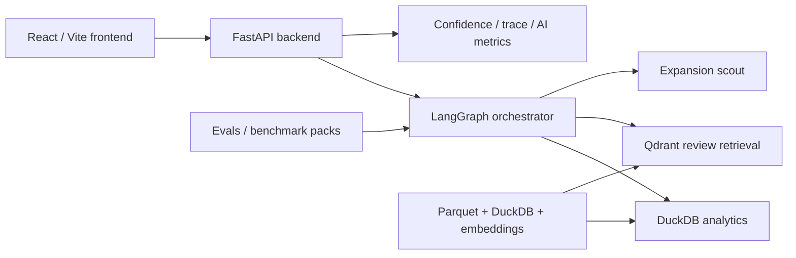
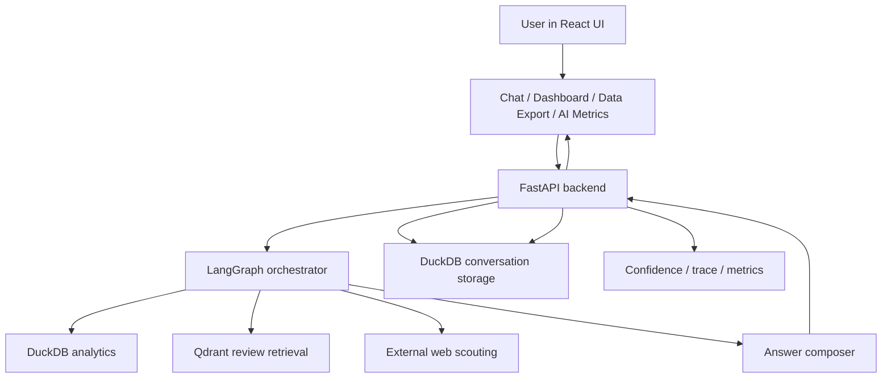
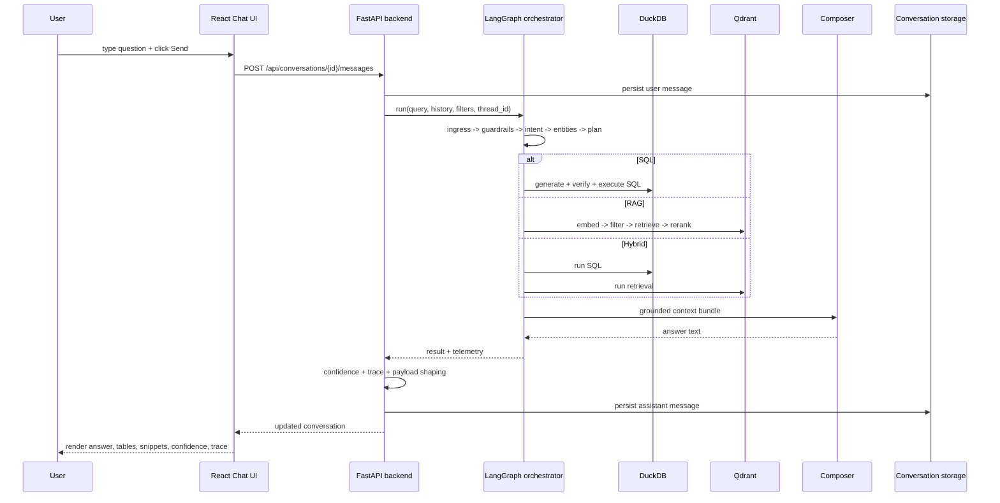
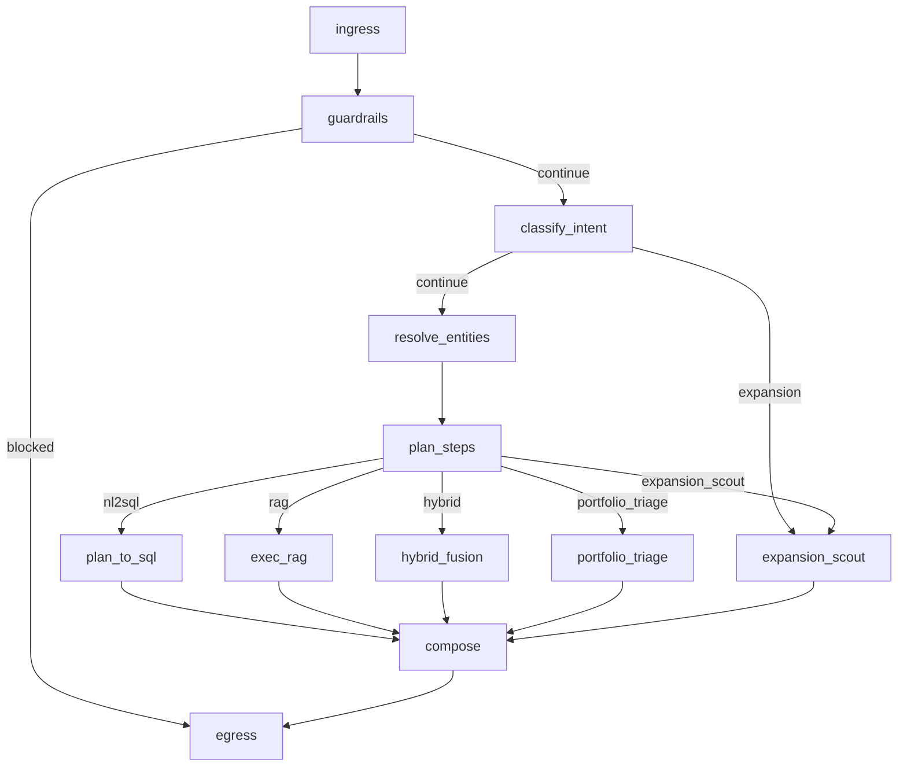
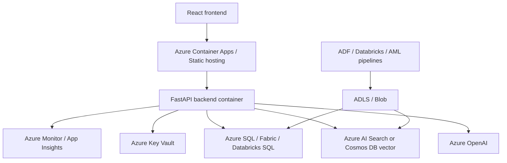

# Interview Mastery Complete Dossier

Generated: 2026-03-31 18:31:52 Eastern Daylight Time

This document is the combined version of every file in `docs/interview_mastery/`.

## Included Sections

- `00_repo_map.md`: Repository Map
- `01_system_overview.md`: System Overview
- `02_end_to_end_query_lifecycle.md`: End-to-End Query Lifecycle
- `03_orchestrator_and_graph.md`: Orchestrator And Graph
- `04_nl_to_sql.md`: NL-to-SQL
- `05_rag_and_vector_search.md`: RAG And Vector Search
- `06_ranking_reranking_and_hallucination_control.md`: Ranking, Reranking, And Hallucination Control
- `07_evaluation_and_accuracy_testing.md`: Evaluation And Accuracy Testing
- `08_frontend_and_user_interactions.md`: Frontend And User Interactions
- `09_backend_and_storage.md`: Backend And Storage
- `10_feature_deep_dives.md`: Feature Deep Dives
- `11_azure_architecture_mapping.md`: Azure Architecture Mapping
- `12_interview_qna_and_grilling.md`: Interview Q&A And Grilling Guide
- `13_quick_revision_sheet.md`: Quick Revision Sheet

## Repository Map

This dossier is repo-grounded. The goal is to make interview answers traceable to code, data artifacts, and real request flows in `wtchtwr`.

### What This Repo Contains

`wtchtwr` combines:

- a FastAPI backend in [`backend/`](../../backend)
- a LangGraph-based agent/orchestrator in [`agent/`](../../agent)
- a React/Vite frontend in [`frontend/`](../../frontend)
- a DuckDB + Parquet analytics layer in [`db/`](../../db) and [`data/`](../../data)
- a Qdrant-backed review retrieval layer in [`vec/`](../../vec)
- an evaluation harness in [`evals/`](../../evals)

### Reconnaissance Note

#### Key backend files

| File | Role |
| --- | --- |
| [`backend/main.py`](../../backend/main.py) | FastAPI app, conversations, streaming, summaries, exports, health, Slack bootstrapping |
| [`backend/ai_observability.py`](../../backend/ai_observability.py) | Confidence, trace payloads, AI metrics aggregation |
| [`backend/dashboard.py`](../../backend/dashboard.py) | Dashboard aggregation over cached parquet/DuckDB features |
| [`backend/dashboard_router.py`](../../backend/dashboard_router.py) | Dashboard endpoints |
| [`backend/data_explorer.py`](../../backend/data_explorer.py) | Structured query builder for Data Export |
| [`backend/data_trust.py`](../../backend/data_trust.py) | Data contracts and quality checks |
| [`backend/business_kpis.py`](../../backend/business_kpis.py) | Business KPI snapshot generation |
| [`backend/emailer.py`](../../backend/emailer.py) | SMTP email delivery |
| [`backend/exporter.py`](../../backend/exporter.py) | In-memory CSV export staging |
| [`backend/gdrive.py`](../../backend/gdrive.py) | Google Drive fallback for large exports |
| [`backend/models.py`](../../backend/models.py) | Pydantic payload models |
| [`backend/storage.py`](../../backend/storage.py) | Legacy file-based storage helpers; no longer the primary persistence path |

#### Key frontend files

| File | Role |
| --- | --- |
| [`frontend/src/App.tsx`](../../frontend/src/App.tsx) | Route map and shell layout |
| [`frontend/src/pages/Chat.tsx`](../../frontend/src/pages/Chat.tsx) | Main chat UX, streaming, summary/export/email flows |
| [`frontend/src/components/ChatInput.tsx`](../../frontend/src/components/ChatInput.tsx) | Query input form |
| [`frontend/src/components/Message.tsx`](../../frontend/src/components/Message.tsx) | Answer rendering, tables, snippets, confidence, AI trace |
| [`frontend/src/pages/Dashboard.tsx`](../../frontend/src/pages/Dashboard.tsx) | Dashboard with map/charts |
| [`frontend/src/pages/DataExport.tsx`](../../frontend/src/pages/DataExport.tsx) | Data Explorer / export workflow |
| [`frontend/src/pages/History.tsx`](../../frontend/src/pages/History.tsx) | Conversation archive |
| [`frontend/src/pages/AiMetrics.tsx`](../../frontend/src/pages/AiMetrics.tsx) | Benchmark dashboard and case inspection |
| [`frontend/src/lib/api.ts`](../../frontend/src/lib/api.ts) | Typed REST client |
| [`frontend/src/store/useChat.ts`](../../frontend/src/store/useChat.ts) | Zustand chat state |

#### Key agent/orchestration files

| File | Role |
| --- | --- |
| [`agent/graph.py`](../../agent/graph.py) | Real orchestrator: ingress, intent, routing, tool execution, compose, egress |
| [`agent/types.py`](../../agent/types.py) | `GraphState` and state bridge helpers |
| [`agent/intents.py`](../../agent/intents.py) | Intent classification and filter extraction |
| [`agent/policy.py`](../../agent/policy.py) | Entity normalization, plan selection, route decision |
| [`agent/nl2sql_llm.py`](../../agent/nl2sql_llm.py) | NL-to-SQL generation, validation, repair, execution |
| [`agent/vector_qdrant.py`](../../agent/vector_qdrant.py) | Retrieval, filters, reranking, evidence summary |
| [`agent/compose.py`](../../agent/compose.py) | Final answer synthesis and deterministic fallback |
| [`agent/portfolio_triage.py`](../../agent/portfolio_triage.py) | Triage workflow |
| [`agent/expansion_scout.py`](../../agent/expansion_scout.py) | Expansion scout workflow |
| [`agent/slack/bot.py`](../../agent/slack/bot.py) | Slack adapter that reuses backend conversation APIs |
| [`agent/config.py`](../../agent/config.py) | Config and environment defaults |

#### Key evaluation files

| File | Role |
| --- | --- |
| [`evals/runner.py`](../../evals/runner.py) | Benchmark executor and assertion engine |
| [`evals/interview_summary.py`](../../evals/interview_summary.py) | Interview-ready rollups |
| [`evals/benchmarks.local.json`](../../evals/benchmarks.local.json) | Tuned regression pack |
| [`evals/benchmarks.holdout.json`](../../evals/benchmarks.holdout.json) | Holdout/generalization pack |
| [`evals/benchmarks.adversarial.json`](../../evals/benchmarks.adversarial.json) | Adversarial pack |
| [`evals/benchmarks.blind.sample.json`](../../evals/benchmarks.blind.sample.json) | Blind starter template, not a full blind suite |
| [`evals/error_taxonomy.md`](../../evals/error_taxonomy.md) | Failure categories |
| [`evals/review_sheet.template.csv`](../../evals/review_sheet.template.csv) | Human review sheet |

#### Key data/schema files

| File or directory | Role |
| --- | --- |
| [`db/airbnb.duckdb`](../../db/airbnb.duckdb) | Structured analytics database |
| [`data/clean/`](../../data/clean) | Clean parquet sources |
| [`vec/airbnb_reviews/`](../../vec/airbnb_reviews) | Embeddings and metadata artifacts |
| [`scripts/rebuild_review_vectors.py`](../../scripts/rebuild_review_vectors.py) | Rebuilds vector store from review data |
| [`scripts/data_quality_report.py`](../../scripts/data_quality_report.py) | Generates data trust report |
| [`docs/data_dictionary.md`](../data_dictionary.md) | Business field definitions |
| [`docs/data_lineage.md`](../data_lineage.md) | Data lineage |

#### Key deployment/config files

| File | Role |
| --- | --- |
| [`requirements.txt`](../../requirements.txt) | Python dependency set |
| [`frontend/package.json`](../../frontend/package.json) | Frontend dependency set |
| [`frontend/tailwind.config.js`](../../frontend/tailwind.config.js) | Tailwind config |
| [`frontend/postcss.config.js`](../../frontend/postcss.config.js) | PostCSS config |
| [`.env.example`](../../.env.example) | Runtime env template |
| [`agent/config.py`](../../agent/config.py) | Env-driven runtime config |

### Repo-Level Architecture

### Reading Order For Interview Prep

If you only read ten things before the interview, use this order:

1. [`README.md`](../../README.md)
2. [`docs/architecture.md`](../architecture.md)
3. [`agent/graph.py`](../../agent/graph.py)
4. [`backend/main.py`](../../backend/main.py)
5. [`agent/nl2sql_llm.py`](../../agent/nl2sql_llm.py)
6. [`agent/vector_qdrant.py`](../../agent/vector_qdrant.py)
7. [`evals/runner.py`](../../evals/runner.py)
8. [`frontend/src/pages/Chat.tsx`](../../frontend/src/pages/Chat.tsx)
9. [`frontend/src/components/Message.tsx`](../../frontend/src/components/Message.tsx)
10. [`frontend/src/pages/AiMetrics.tsx`](../../frontend/src/pages/AiMetrics.tsx)

### Honest Scope Notes

- There is **no full IaC / deployment manifest layer** in the repo. The runtime story is local env + local Docker + app startup.
- [`backend/storage.py`](../../backend/storage.py) still exists, but the current web app persists conversations through DuckDB tables managed in [`backend/main.py::ensure_schema`](../../backend/main.py).
- The benchmark story is strong for a portfolio project, but the blind evaluation artifact is only a **starter sample**, not a mature untouched blind set.
- The graph includes defensive patch logic in [`agent/graph.py::_compose_node`](../../agent/graph.py), especially around hybrid fusion. That is worth acknowledging as real iterative hardening rather than pretending the architecture is perfectly clean.

---

## System Overview

### Plain-English Version

`wtchtwr` is a decision-support copilot for short-term rental operators. A user can ask:

- "Average occupancy for my Highbury listings in Manhattan"
- "What are guests complaining about in Midtown?"
- "Compare our pricing to the market and explain likely review drivers"
- "Which neighborhoods should Highbury consider next?"

The system answers those questions by combining:

- structured analytics from DuckDB
- unstructured review retrieval from Qdrant
- a graph-based orchestrator that decides which path to use
- a frontend that shows not just the answer, but also tables, trace, and confidence

Repo anchors:

- product framing: [`README.md`](../../README.md)
- simplified architecture: [`docs/architecture.md`](../architecture.md)
- real request entry: [`backend/main.py`](../../backend/main.py)
- real orchestrator: [`agent/graph.py`](../../agent/graph.py)

### Business Problem It Solves

The repo is built around one central problem: operational rental data is fragmented across:

- structured portfolio metrics
- qualitative guest reviews
- neighborhood expansion signals

The system reduces that fragmentation by letting users ask one question instead of manually:

- writing SQL
- opening dashboards
- scanning reviews
- stitching together market notes

This value framing is explicit in [`README.md`](../../README.md) and reinforced by [`backend/business_kpis.py::build_business_kpi_snapshot`](../../backend/business_kpis.py).

### User Personas Supported By Code

| Persona | Need | Repo evidence |
| --- | --- | --- |
| Operations manager | weak listings, guest issues, QA gaps | [`agent/portfolio_triage.py::run_portfolio_triage`](../../agent/portfolio_triage.py) |
| Revenue manager | ADR / occupancy / revenue vs market | [`agent/nl2sql_llm.py`](../../agent/nl2sql_llm.py), [`frontend/src/pages/Dashboard.tsx`](../../frontend/src/pages/Dashboard.tsx) |
| Expansion lead | future neighborhoods with external signals | [`agent/expansion_scout.py::exec_expansion_scout`](../../agent/expansion_scout.py) |
| Analyst / operator | chat, summarize, export, email findings | [`backend/main.py`](../../backend/main.py), [`frontend/src/pages/Chat.tsx`](../../frontend/src/pages/Chat.tsx), [`frontend/src/pages/DataExport.tsx`](../../frontend/src/pages/DataExport.tsx) |

### Why An Agentic Architecture Fits This Repo

#### Interview language

An agentic architecture makes sense because the application has to choose among multiple tools and workflows:

- SQL for structured truth
- retrieval for review evidence
- hybrid fusion for metric + narrative questions
- a triage workflow for operational diagnosis
- an expansion workflow for external market signals

A single prompt would be much harder to constrain, debug, or evaluate.

#### Implementation language

This repo is "agentic" because it does all of the following in code:

- maintains structured state via [`agent/types.py::GraphState`](../../agent/types.py)
- classifies intent with [`agent/intents.py::classify_intent`](../../agent/intents.py)
- normalizes entities with [`agent/policy.py::resolve_entities`](../../agent/policy.py)
- plans a route with [`agent/policy.py::plan_steps`](../../agent/policy.py)
- conditionally invokes different tools inside [`agent/graph.py::build_graph`](../../agent/graph.py)
- can run SQL and RAG concurrently in [`agent/graph.py::_hybrid_fusion_node`](../../agent/graph.py)
- computes confidence and abstention signals in [`backend/ai_observability.py`](../../backend/ai_observability.py)
- persists conversation and thread context in [`backend/main.py`](../../backend/main.py)

That is materially different from "one LLM call with a lot of instructions."

### What “Agentic” Means Here Specifically

In this repo, "agentic" means a **constrained orchestrator** with explicit routing and tool use.

#### What it does

- classify question type
- extract business filters
- choose one execution mode
- run the selected tool path
- normalize outputs into one bundle
- synthesize an answer
- attach confidence and trace metadata

#### What it does not do

- no arbitrary tool marketplace
- no long-horizon autonomous planning across many systems
- no recursive self-reflection loop
- no open-ended action-taking outside prewired workflows

That narrower design is a deliberate tradeoff toward controllability.

### Top-Level Architecture

### Main Subsystems And Interactions

| Subsystem | Main files | Responsibility |
| --- | --- | --- |
| Frontend shell | [`frontend/src/App.tsx`](../../frontend/src/App.tsx) | Routes users to chat, dashboard, history, data export, AI metrics |
| Chat experience | [`frontend/src/pages/Chat.tsx`](../../frontend/src/pages/Chat.tsx), [`frontend/src/components/Message.tsx`](../../frontend/src/components/Message.tsx) | Sends prompts, handles streaming, renders answers/trace/confidence |
| API + persistence | [`backend/main.py`](../../backend/main.py) | Conversations, messages, summaries, export/email, health, AI metrics |
| Orchestrator | [`agent/graph.py`](../../agent/graph.py) | Stateful node graph and routing |
| Intent/policy | [`agent/intents.py`](../../agent/intents.py), [`agent/policy.py`](../../agent/policy.py) | Intent, scope, filters, plan mode |
| SQL toolchain | [`agent/nl2sql_llm.py`](../../agent/nl2sql_llm.py) | SQL generation, validation, repair, execution |
| Retrieval toolchain | [`agent/vector_qdrant.py`](../../agent/vector_qdrant.py) | Embeddings search, filters, reranking, evidence summary |
| Domain workflows | [`agent/portfolio_triage.py`](../../agent/portfolio_triage.py), [`agent/expansion_scout.py`](../../agent/expansion_scout.py) | Triage and external-signal scouting |
| Evaluation layer | [`evals/runner.py`](../../evals/runner.py), [`evals/interview_summary.py`](../../evals/interview_summary.py) | Accuracy, latency, benchmark reporting |

### High-Level Request Lifecycle

1. User types into the React chat UI.
2. Frontend posts to `POST /api/conversations/{id}/messages`.
3. Backend persists the user message and recent history.
4. Backend invokes the LangGraph orchestrator.
5. Graph runs ingress, guardrails, intent classification, entity resolution, and planning.
6. Graph routes to SQL, RAG, hybrid, triage, or expansion.
7. Tool outputs are normalized into `result_bundle`.
8. Composer builds the final grounded answer.
9. Backend adds confidence and trace payloads.
10. Assistant message is persisted and returned to the frontend.
11. Frontend renders answer text, tables, snippets, confidence, and AI trace.

This lifecycle is implemented primarily across:

- [`frontend/src/pages/Chat.tsx`](../../frontend/src/pages/Chat.tsx)
- [`backend/main.py`](../../backend/main.py)
- [`agent/graph.py`](../../agent/graph.py)
- [`backend/ai_observability.py`](../../backend/ai_observability.py)

### Why The Design Likely Exists

The codebase consistently prefers:

- explicit state over hidden prompt context
- deterministic tool routes over pure LLM free-form answers
- local analytics stack (DuckDB + Parquet) over warehouse dependencies
- lightweight retrieval (SentenceTransformer + Qdrant) over heavier enterprise stacks
- benchmark-driven iteration over anecdotal demos

Likely reasons:

- fast local development
- reproducible interview/demo environment
- easier debugging
- clearer evaluation boundaries

### Alternatives The Repo Could Have Used

| Problem | Current choice | Plausible alternative | Why the current choice is understandable |
| --- | --- | --- | --- |
| Orchestration | LangGraph | one big prompt, plain Python router, Semantic Kernel | LangGraph makes routing/state explicit |
| Structured analytics | DuckDB | Postgres, BigQuery, Snowflake | DuckDB is excellent for local analytics demos |
| Vector retrieval | Qdrant | Chroma, pgvector, Azure AI Search | Qdrant is lightweight and straightforward locally |
| Embeddings | `all-MiniLM-L6-v2` | OpenAI embeddings, BGE, E5 | cheap, local, good enough for review retrieval |
| Frontend | React/Vite | Next.js, Streamlit | React gives more control over trace/metrics UX |

### Technology Choices And Why This Stack Makes Sense

| Technology | Used where | What it does here | Why it likely was chosen | Reasonable alternative |
| --- | --- | --- | --- | --- |
| FastAPI | [`backend/main.py`](../../backend/main.py) | API layer and streaming responses | clean Python API surface, easy JSON + SSE-style streaming | Flask, Django, Node/Express |
| React | [`frontend/src`](../../frontend/src) | main frontend framework | flexible SPA for multiple product surfaces | Next.js, Streamlit |
| Tailwind CSS | [`frontend/src/index.css`](../../frontend/src/index.css) | utility-first styling | fast iteration, consistent styling | CSS modules, styled-components |
| Deck.gl | [`frontend/src/pages/Dashboard.tsx`](../../frontend/src/pages/Dashboard.tsx) | listing coverage map | better for many map points than simple DOM maps | Leaflet, Mapbox GL |
| LangGraph | [`agent/graph.py`](../../agent/graph.py) | stateful orchestration | explicit graph/state model | plain Python router, Semantic Kernel |
| LangChain ecosystem imports | in agent/compose/expansion support | auxiliary model/document utilities | ecosystem convenience without giving up app-level control | direct SDK-only approach |
| DuckDB | SQL path, dashboard, explorer | local analytical execution | excellent for Parquet-scale local analytics | Postgres, warehouse, Fabric |
| Qdrant | [`agent/vector_qdrant.py`](../../agent/vector_qdrant.py) | vector retrieval | simple OSS vector DB for local dev | Azure AI Search, pgvector, Chroma |
| SentenceTransformer MiniLM | [`scripts/rebuild_review_vectors.py`](../../scripts/rebuild_review_vectors.py) | local embeddings | inexpensive and local | OpenAI embeddings, BGE |
| OpenAI API | compose, SQL, expansion synthesis | language reasoning and synthesis | straightforward high-quality model access | Azure OpenAI, Anthropic, local models |
| Docker | local Qdrant runtime | dependency isolation | simple local service bring-up | native install, cloud service |
| Custom eval harness | [`evals/`](../../evals) | benchmarking and reporting | tightly matched to repo behavior | LangSmith-style evals, Azure ML evals |
| Custom observability layer | [`backend/ai_observability.py`](../../backend/ai_observability.py) | confidence, trace, benchmark payloads | project-specific explainability needs | generic tracing SDK only |

### Strong Architectural Points

- explicit graph/state model
- deterministic separation between SQL, RAG, hybrid, triage, and expansion
- confidence + trace surfaced to users
- benchmark packs integrated into the product via `/api/ai/metrics`
- data contracts and trust tooling exist in the repo, not just marketing copy

### Weak Spots To Be Honest About

- The system is production-inspired, not fully productionized. There is no IaC/deployment stack in-repo.
- Some graph logic in [`agent/graph.py::_compose_node`](../../agent/graph.py) is visibly patchy, especially around hybrid result fusion.
- Expansion uses external HTTP fetch + parsing in [`agent/expansion_scout.py`](../../agent/expansion_scout.py), so it is less deterministic than SQL/RAG.
- [`backend/storage.py`](../../backend/storage.py) coexists with current DuckDB-backed persistence and reads like legacy tech debt.

### Interviewer May Ask

#### “Why not one prompt?”

Because this repo has multiple evidence types and failure modes. SQL, review retrieval, portfolio triage, and expansion scouting are different tasks. The graph makes the route explicit and measurable.

#### “What is the strongest architectural point?”

The strongest point is the separation between orchestration, deterministic tools, synthesis, and evaluation. The code does not rely on one opaque LLM call.

---

## End-to-End Query Lifecycle

This is the most important “walk me through it” document in the set. It traces what happens from user input to rendered answer using the actual code path.

### Plain-English Walkthrough

When a user sends a question, the frontend posts it to the FastAPI backend. The backend saves the user message, loads recent history, and invokes the LangGraph orchestrator. The graph classifies the question, extracts filters, chooses whether to use SQL, retrieval, hybrid fusion, triage, or expansion, runs the relevant tool path, builds a normalized result bundle, asks the composer to turn that into a user-facing answer, computes confidence and trace metadata, stores the assistant message, and returns the updated conversation. The frontend then renders the answer, any tables, retrieved snippets, confidence, and AI trace.

### Lifecycle Diagram

### 1. Frontend Captures The Query

The visible input box is [`frontend/src/components/ChatInput.tsx`](../../frontend/src/components/ChatInput.tsx). It only owns local text state and calls `onSend(text)` when submitted.

The actual chat send logic lives in [`frontend/src/pages/Chat.tsx::handleSend`](../../frontend/src/pages/Chat.tsx).

Why this split exists:

- `ChatInput` stays dumb and reusable
- `Chat.tsx` owns streaming, optimistic UI, pending assistant messages, summary/export/email controls

Potential failure points:

- empty prompt
- command-mode interception (`dashboard`, `slackbot`, `help`)
- network failure before stream opens

### 2. Frontend Sends The Request

The chat page uses direct `fetch` for streaming in [`frontend/src/pages/Chat.tsx::handleSend`](../../frontend/src/pages/Chat.tsx), posting to:

- `POST /api/conversations/{conversationId}/messages`

Body fields include:

- `content`
- `stream: true`
- `thread_id`
- `debug_thinking`

There is also a typed non-stream helper in [`frontend/src/lib/api.ts::sendMessage`](../../frontend/src/lib/api.ts), but the live chat page uses the streaming path directly.

Why:

- streaming gives token-by-token feedback
- the final payload still arrives as a full normalized conversation object

Potential failure points:

- response body missing
- malformed stream events
- stream ends without a final payload

### 3. Backend Validates The Request

The request lands in [`backend/main.py::post_message`](../../backend/main.py).

That function:

1. logs the payload
2. extracts the question from `query` or `content`
3. rejects empty questions with HTTP 400
4. reads optional runtime flags:
   - `tenant`
   - `user_filters`
   - `composer_enabled`
   - `stream`
   - `debug_thinking`

Why:

- validate at the API boundary before touching orchestration

Potential failure points:

- empty question
- malformed payload
- persistence failure before orchestration

### 4. Conversation History And Thread State Are Loaded

`post_message` calls [`backend/main.py::_record_user_message`](../../backend/main.py), which:

- fetches the conversation via `fetch_conversation(...)`
- inserts the user message with `insert_message(...)`
- maps the conversation to `thread_map` via `map_thread_to_conversation(...)`
- trims history with `trim_history(...)`

Conversation tables are created in [`backend/main.py::ensure_schema`](../../backend/main.py):

- `conversations`
- `messages`
- `exports_cache`
- `thread_map`

Why:

- the graph needs recent conversational context and a stable thread ID

Potential failure points:

- DuckDB lock/contention
- missing conversation row
- stale thread mapping

### 5. Backend Invokes The Orchestrator

For synchronous mode, [`backend/main.py::_execute_langgraph`](../../backend/main.py) calls [`agent/graph.py::run`](../../agent/graph.py).

For streaming mode, [`backend/main.py::_stream_response`](../../backend/main.py) calls [`agent/graph.py::stream`](../../agent/graph.py).

Both paths run the same graph logic.

Inputs passed into the agent include:

- `query`
- `tenant`
- `user_filters`
- `history`
- `thread_id`
- `composer_enabled`
- `debug_thinking`

### 6. Ingress Node Bootstraps State

The first graph node is [`agent/graph.py::_ingress_node`](../../agent/graph.py).

It:

- blocks extremely long queries early
- ensures `raw_input` contains query/tenant/history/debug flags
- merges existing thread memory
- calls legacy ingress helpers
- converts legacy state into `GraphState`

Why:

- standardize state shape before routing/tool execution

Potential failure points:

- stale memory polluting a new request
- oversimplified length guard blocking legitimate verbose prompts

### 7. Guardrails Run Before Expensive Work

[`agent/graph.py::_guardrails_node`](../../agent/graph.py) delegates to guardrail logic in [`agent/guards.py::guardrails`](../../agent/guards.py).

`_guardrail_route(...)` can send the graph directly to `egress`.

Why:

- fail early before SQL generation, retrieval, or composition

Potential failure points:

- false positives / false negatives in blocking

### 8. Intent Classification Happens

[`agent/graph.py::_classify_intent_node`](../../agent/graph.py) calls [`agent/intents.py::classify_intent`](../../agent/intents.py).

This stage determines:

- intent
- scope
- rough filters

Examples of handled intents:

- greeting / thanks / smalltalk
- expansion scout
- portfolio triage
- sentiment review question
- structured SQL question
- compare / hybrid question

It also extracts:

- borough
- neighborhood
- month
- year
- listing ID
- `is_highbury`
- sentiment label

Why:

- route selection depends on understanding question type and scope first

Potential failure points:

- ambiguous prompts
- compare prompts misclassified as pure sentiment
- missed geography or portfolio ownership cues

### 9. Entities And Filters Are Normalized

[`agent/graph.py::_resolve_entities_node`](../../agent/graph.py) calls [`agent/policy.py::resolve_entities`](../../agent/policy.py).

This normalizes:

- borough casing
- month names to abbreviations
- year types
- `is_highbury`
- sentiment labels

Why:

- SQL and Qdrant filtering should operate on canonical values

Potential failure points:

- over-normalization removing nuance
- missing support for unusual user wording

### 10. The Planner Chooses A Route

[`agent/graph.py::_plan_steps_node`](../../agent/graph.py) calls [`agent/policy.py::plan_steps`](../../agent/policy.py).

This sets a `plan` that includes:

- `mode`
- `policy`
- `sql_table`
- `top_k`
- `use_sentiment`

Conditional routing is then handled by [`agent/policy.py::choose_path`](../../agent/policy.py), which is wired into [`agent/graph.py::build_graph`](../../agent/graph.py).

Possible routes:

- `nl2sql`
- `rag`
- `hybrid`
- `portfolio_triage`
- `expansion_scout`

Why:

- this is the control plane; it keeps the rest of the system deterministic

Potential failure points:

- wrong policy chosen for ambiguous compare prompts
- triage intent overridden by generic SQL/RAG heuristics

### 11. One Of The Execution Paths Runs

#### SQL path

[`agent/graph.py::_plan_to_sql_node`](../../agent/graph.py) calls [`agent/nl2sql_llm.py::plan_to_sql_llm`](../../agent/nl2sql_llm.py).

That path:

- builds a schema-aware prompt
- asks the model for SQL
- cleans and verifies SQL
- repairs it if needed
- executes on DuckDB
- stores rows, columns, markdown table, and summary in `state.sql`

#### RAG path

[`agent/graph.py::_exec_rag_node`](../../agent/graph.py) calls:

- [`agent/vector_qdrant.py::exec_rag`](../../agent/vector_qdrant.py)
- then [`agent/vector_qdrant.py::summarize_hits`](../../agent/vector_qdrant.py)

That path:

- embeds the query
- searches Qdrant
- applies metadata filters
- reranks hits
- deduplicates
- creates a retrieval summary

#### Hybrid path

[`agent/graph.py::_hybrid_fusion_node`](../../agent/graph.py) runs SQL and RAG concurrently using `ThreadPoolExecutor`, then merges their outputs into one `result_bundle`.

#### Portfolio triage path

[`agent/graph.py::_portfolio_triage_node`](../../agent/graph.py) calls [`agent/portfolio_triage.py::run_portfolio_triage`](../../agent/portfolio_triage.py).

#### Expansion path

[`agent/graph.py::_expansion_scout_node`](../../agent/graph.py) calls [`agent/expansion_scout.py::exec_expansion_scout`](../../agent/expansion_scout.py).

### 12. Intermediate Results Are Normalized

Before final composition, [`agent/graph.py::_compose_node`](../../agent/graph.py) prepares a common `result_bundle`.

Typical bundle fields:

- `policy`
- `scope`
- `filters`
- `rows`
- `columns`
- `aggregates`
- `sql`
- `markdown_table`
- `rag_snippets`
- `summary`
- `portfolio_triage`
- `expansion_report`

Why:

- the composer should not need to understand each tool’s native output format

Potential failure points:

- hybrid branch drops SQL rows or RAG snippets
- patch blocks mask deeper shape inconsistencies

### 13. Final Answer Is Composed

[`agent/graph.py::_compose_node`](../../agent/graph.py) eventually calls [`agent/compose.py::compose_answer`](../../agent/compose.py). If composition is disabled or fails, it falls back to [`agent/compose.py::fallback_text`](../../agent/compose.py).

The composer receives:

- policy
- filters
- SQL preview
- review summary/snippets
- triage context
- expansion sources

Why:

- tool outputs are not user-ready; they need grounded narration

Potential failure points:

- SQL leakage into final prose
- weak evidence overstated as broad truth

### 14. Confidence, Trace, And Grounding Metadata Are Attached

After the graph returns, [`backend/main.py::build_assistant_payload`](../../backend/main.py) computes:

- `confidence` via [`backend/ai_observability.py::build_confidence_payload`](../../backend/ai_observability.py)
- `trace` via [`backend/ai_observability.py::build_trace_payload`](../../backend/ai_observability.py)

If abstention is recommended, `build_assistant_payload(...)` rewrites the summary into a safer response and sets `abstained = True`.

Why:

- this is the repo’s main anti-hallucination UX layer

### 15. The Result Is Persisted

[`backend/main.py::_finalize_assistant_message`](../../backend/main.py):

- chooses final content
- strips SQL if it leaked
- writes `answer_text` and `result_bundle.summary`
- builds assistant payload
- inserts the assistant message into `messages`
- fetches the updated conversation

Why:

- the persisted conversation should match the final response object shown in the UI

### 16. The Frontend Renders The Response

In streaming mode:

- [`frontend/src/pages/Chat.tsx::handleSend`](../../frontend/src/pages/Chat.tsx) reads event chunks
- token events are appended into a pending assistant bubble
- the final payload replaces/normalizes the local pending state

Rendering happens in [`frontend/src/components/Message.tsx`](../../frontend/src/components/Message.tsx), which shows:

- answer markdown
- tables
- review snippets
- confidence
- AI trace
- sentiment analytics

Shared chat state is handled in [`frontend/src/store/useChat.ts`](../../frontend/src/store/useChat.ts).

Potential failure points:

- streaming tokens diverge from final payload
- message payload missing keys expected by `Message.tsx`
- large tables overwhelm the UI

### Critical Failure Points To Know

| Stage | Likely risk |
| --- | --- |
| Frontend streaming | partial tokens without final payload |
| Persistence | DuckDB contention / mode mismatch |
| Intent/policy | wrong route for ambiguous compare or triage prompts |
| NL-to-SQL | valid-looking but semantically wrong SQL |
| Retrieval | weak evidence or wrong metadata slice |
| Hybrid fusion | one branch overwriting the other |
| Composition | grounded data restated too confidently |

### Interviewer May Ask

#### “Where is the single most important function in the lifecycle?”

If you had to pick one, it is [`agent/graph.py::_compose_node`](../../agent/graph.py), because that is where all upstream routing/tool work is normalized and turned into the final answer context.

#### “Where would you debug a wrong answer first?”

Start in this order:

1. [`backend/main.py::post_message`](../../backend/main.py)
2. [`agent/intents.py::classify_intent`](../../agent/intents.py)
3. [`agent/policy.py::plan_steps`](../../agent/policy.py)
4. [`agent/nl2sql_llm.py`](../../agent/nl2sql_llm.py) or [`agent/vector_qdrant.py`](../../agent/vector_qdrant.py)
5. [`agent/graph.py::_compose_node`](../../agent/graph.py)
6. [`backend/ai_observability.py`](../../backend/ai_observability.py)

---

## Orchestrator And Graph

### Plain-English Version

The orchestrator is the brain of the system. Instead of sending the user question straight to one LLM prompt, the repo moves a structured state object through a graph of nodes. Each node has one job: bootstrap state, classify intent, normalize filters, choose a plan, run a tool, compose the answer, or package the final result.

The benefit is control. The tradeoff is complexity.

Repo anchors:

- graph definition: [`agent/graph.py`](../../agent/graph.py)
- state model: [`agent/types.py`](../../agent/types.py)
- planner/routing: [`agent/policy.py`](../../agent/policy.py)

### GraphState: What The Orchestrator Passes Around

The state object is defined in [`agent/types.py::GraphState`](../../agent/types.py).

Important fields:

| Field | Purpose |
| --- | --- |
| `query` | user question |
| `tenant` | tenant / caller context |
| `intent` | classified intent label |
| `scope` | portfolio/market/hybrid/general scope |
| `filters` | normalized extracted filters |
| `plan` | route decision and policy |
| `sql` | SQL path output |
| `rag` | retrieval path output |
| `result_bundle` | normalized bundle for composition |
| `telemetry` | latencies, usage, degraded reasons |
| `memory` | thread-level remembered context |
| `history` | recent conversation turns |
| `extras` | side-channel fields like `answer_text`, `portfolio_triage` |
| `thinking` | optional debug trace entries |

Why this matters:

- interviewer can see that state is explicit
- each node can be reasoned about independently
- debugging is easier than one opaque prompt

### State Bridging And Legacy Compatibility

The orchestrator is not fully “pure GraphState.” It bridges between legacy dict-style state and `GraphState` using:

- [`agent/types.py::state_to_graph`](../../agent/types.py)
- [`agent/types.py::graph_to_state`](../../agent/types.py)

Likely reason:

- the repo appears to have evolved from older dict-based orchestration into LangGraph

Tradeoff:

- faster migration
- more compatibility glue
- more risk of duplicated or drifting fields

### Node Order In The Real Graph

`build_graph()` in [`agent/graph.py::build_graph`](../../agent/graph.py) wires the graph like this:

### Node-By-Node Walkthrough

#### 1. `_ingress_node`

File: [`agent/graph.py::_ingress_node`](../../agent/graph.py)

What it does:

- rejects very long queries
- injects query/tenant/debug flags into `raw_input`
- merges history and user filters
- merges existing memory into the current request
- converts legacy ingress output into `GraphState`

Why it exists:

- create a clean, normalized starting state

#### 2. `_guardrails_node`

File: [`agent/graph.py::_guardrails_node`](../../agent/graph.py)

What it does:

- delegates to legacy guardrail logic
- marks `guardrail_blocked`

Why it exists:

- block unsupported or malformed requests before expensive work

#### 3. `_classify_intent_node`

File: [`agent/graph.py::_classify_intent_node`](../../agent/graph.py)

What it does:

- calls [`agent/intents.py::classify_intent`](../../agent/intents.py)
- stores an `intent_hint` in telemetry
- persists `last_intent` and `last_scope` into memory

Why it exists:

- later routing depends on both intent and scope

#### 4. `_resolve_entities_node`

File: [`agent/graph.py::_resolve_entities_node`](../../agent/graph.py)

What it does:

- calls [`agent/policy.py::resolve_entities`](../../agent/policy.py)
- persists `last_filters` into memory

#### 5. `_plan_steps_node`

File: [`agent/graph.py::_plan_steps_node`](../../agent/graph.py)

What it does:

- calls [`agent/policy.py::plan_steps`](../../agent/policy.py)
- persists `last_plan`

Why it exists:

- separate “what the question means” from “which tool path to run”

#### 6. `_plan_to_sql_node`

File: [`agent/graph.py::_plan_to_sql_node`](../../agent/graph.py)

What it does:

- calls [`agent/nl2sql_llm.py::plan_to_sql_llm`](../../agent/nl2sql_llm.py)
- stores a small SQL memory summary

#### 7. `_exec_rag_node`

File: [`agent/graph.py::_exec_rag_node`](../../agent/graph.py)

What it does:

- calls legacy retrieval execution + summarization
- stores `last_rag` summary and a small hit sample in memory

#### 8. `_expansion_scout_node`

File: [`agent/graph.py::_expansion_scout_node`](../../agent/graph.py)

What it does:

- calls [`agent/expansion_scout.py::exec_expansion_scout`](../../agent/expansion_scout.py)

#### 9. `_hybrid_fusion_node`

File: [`agent/graph.py::_hybrid_fusion_node`](../../agent/graph.py)

What it does:

- checks if hybrid is truly requested
- runs SQL and RAG concurrently using `ThreadPoolExecutor`
- merges both states with `_merge_states(...)`
- records fusion telemetry
- assembles a fused result bundle

Why it exists:

- hybrid questions are a first-class workflow in this repo, not a post-hoc prompt trick

Tradeoff:

- more complexity around merging and state recovery

#### 10. `_portfolio_triage_node`

File: [`agent/graph.py::_portfolio_triage_node`](../../agent/graph.py)

What it does:

- runs [`agent/portfolio_triage.py::run_portfolio_triage`](../../agent/portfolio_triage.py)

#### 11. `_compose_node`

File: [`agent/graph.py::_compose_node`](../../agent/graph.py)

What it does:

- prepares and patches the bundle
- special-cases conversational intents
- recovers missing SQL table data for hybrid flows
- injects markdown tables when missing
- delegates to `_compose_legacy(...)`
- persists `last_answer` and a compose thinking step

Why it exists:

- unify all branches into one user-facing answer context

Honest note:

This is one of the messier parts of the repo. It contains several compatibility and recovery blocks that were clearly added during iterative hardening.

#### 12. `_egress_node`

File: [`agent/graph.py::_egress_node`](../../agent/graph.py)

What it does:

- delegates to legacy egress
- attaches telemetry, state snapshot, memory, sql, rag
- stores a `conversation_trace` block in memory

### Memory Model

The graph uses an in-memory checkpoint store:

- [`agent/graph.py::_memory_store`](../../agent/graph.py)
- backed by `MemorySaver`
- accessed through `get_memory_context(...)` and `save_memory_context(...)`

What is stored:

- last query
- last intent
- last scope
- last filters
- last plan
- last SQL summary
- last RAG summary
- last answer
- conversation trace

Why this design likely exists:

- gives thread-local short memory without requiring another persistence service

Limitations:

- process-local only
- not durable across restarts
- not suitable for scaled multi-instance deployment as-is

### Tool Invocation Model

The graph does not use an open-ended tool-calling agent that picks arbitrary tools. Tool invocation is route-driven:

- SQL -> [`agent/nl2sql_llm.py`](../../agent/nl2sql_llm.py)
- RAG -> [`agent/vector_qdrant.py`](../../agent/vector_qdrant.py)
- expansion -> [`agent/expansion_scout.py`](../../agent/expansion_scout.py)
- triage -> [`agent/portfolio_triage.py`](../../agent/portfolio_triage.py)

Why this choice is sensible:

- easier to debug
- easier to evaluate
- easier to constrain

### Fallback And Degraded Behavior

Important fallback points:

- compose failure -> [`agent/compose.py::fallback_text`](../../agent/compose.py)
- RAG contradiction / “no reviews” despite hits -> `_needs_rag_fallback(...)` and `_rag_fallback_answer(...)` in [`agent/graph.py`](../../agent/graph.py)
- missing grounded portfolio evidence -> `_should_abstain_for_missing_portfolio_evidence(...)`
- backend-level abstention rewrite -> [`backend/main.py::build_assistant_payload`](../../backend/main.py)

This is one of the stronger design choices in the repo: it tries not to let weak evidence silently become confident prose.

### Why Use A Graph Instead Of One Big Prompt

#### Benefits

- explicit state transitions
- deterministic route control
- per-branch telemetry
- better hybrid execution
- easier degraded mode handling
- easier evaluation by stage

#### Tradeoffs

- more moving parts
- more state-shape complexity
- legacy bridge code
- patchiness in compose/fusion logic

### Strong Points To Highlight

- explicit `GraphState`
- conditional route selection
- parallel hybrid execution
- short-term memory separated from durable conversation storage
- fallback and abstention logic integrated into orchestration

### Weak Spots To Admit

- `_compose_node` is doing a lot of defensive recovery work
- memory is in-process only
- some nodes still rely on legacy helper flow instead of a fully graph-native implementation

---

## NL-to-SQL

### Plain-English Version

For structured questions, the system turns the user’s request into DuckDB SQL, validates that SQL, repairs common mistakes, executes it, and only then uses the results to build a natural-language answer.

That is much safer than “ask the model for the answer directly,” because the model is forced to go through the database.

Repo anchors:

- main SQL pipeline: [`agent/nl2sql_llm.py`](../../agent/nl2sql_llm.py)
- route into SQL: [`agent/graph.py::_plan_to_sql_node`](../../agent/graph.py)
- planner choosing SQL policy: [`agent/policy.py::plan_steps`](../../agent/policy.py)

### Where The SQL Path Begins

The SQL path is chosen in [`agent/policy.py::plan_steps`](../../agent/policy.py), then executed by [`agent/graph.py::_plan_to_sql_node`](../../agent/graph.py), which calls [`agent/nl2sql_llm.py::plan_to_sql_llm`](../../agent/nl2sql_llm.py).

Common policies include:

- `SQL_HIGHBURY`
- `SQL_MARKET`
- `SQL_COMPARE`

These depend on intent and scope produced earlier in the graph.

### How Schema Grounding Is Done

The most important grounding artifact is `SCHEMA_BLOCK` in [`agent/nl2sql_llm.py`](../../agent/nl2sql_llm.py).

That block explicitly lists tables such as:

- `listings_cleaned`
- `highbury_listings`
- `amenities_norm`

It also encodes business semantics, for example:

- `neighbourhood_group` means borough
- occupancy fields are future occupancy projections
- revenue fields are estimated revenue in USD
- avoid using `is_highbury` where the column does not exist

Why this matters:

- the model is not expected to infer schema from memory
- the prompt gives both table names and domain meaning

### How The Prompt Is Built

[`agent/nl2sql_llm.py::build_prompt`](../../agent/nl2sql_llm.py) combines:

- schema block
- SQL guidelines
- current user query
- normalized filter hints

The prompt is aimed at DuckDB SQL specifically, not generic ANSI SQL.

Likely design reason:

- pragmatic and easy to inspect
- tailored to the repo’s actual schema
- lightweight compared with planner-heavy systems

### How SQL Is Generated

`plan_to_sql_llm(...)` in [`agent/nl2sql_llm.py`](../../agent/nl2sql_llm.py):

1. skips non-SQL conversational intents
2. builds the prompt
3. streams SQL from the model with `_stream_sql(...)`
4. rejects obviously unsafe/non-SELECT SQL
5. validates and repairs the SQL
6. executes the query
7. writes structured SQL output into `state.sql`

Model defaults in the repo:

- primary default: `gpt-4o-mini`
- fallback default: `gpt-4o`
- repair default: `gpt-4o-mini`

These are configurable via env vars in [`agent/nl2sql_llm.py`](../../agent/nl2sql_llm.py) and [`agent/config.py`](../../agent/config.py).

### SQL Cleaning Before Execution

Before validation/execution, [`agent/nl2sql_llm.py::clean_sql_before_execute`](../../agent/nl2sql_llm.py) strips or normalizes known bad patterns, including problematic `is_highbury` usage.

Why this exists:

- some model errors are common enough that deterministic cleanup is cheaper than an LLM retry

### SQL Verification

The first hard safeguard is [`agent/nl2sql_llm.py::verify_sql`](../../agent/nl2sql_llm.py), which runs DuckDB `EXPLAIN`.

If `EXPLAIN` works, the SQL is considered syntactically and structurally valid enough to execute.

What it catches:

- malformed SQL
- missing tables
- missing columns
- parser errors

What it does **not** catch:

- semantic correctness
- wrong aggregation or wrong table choice

### SQL Repair Loop

If verification fails, [`agent/nl2sql_llm.py::verify_and_repair_sql`](../../agent/nl2sql_llm.py) tries:

1. `_repair_sql_rule_based(...)`
2. `_repair_sql_with_llm(...)`

#### Rule-based repair

Used for predictable issues:

- known invalid patterns
- minor syntax cleanup
- repeated bad clauses

#### LLM repair

Used when rule-based repair cannot recover the query.

Why this design likely exists:

- deterministic repair is cheaper and easier to trust
- LLM repair is reserved for harder cases

### SQL Execution

Execution happens in [`agent/nl2sql_llm.py::execute_duckdb`](../../agent/nl2sql_llm.py).

That function:

- opens DuckDB
- executes the SQL
- fetches results into a DataFrame
- returns a normalized result containing:
  - rows
  - columns
  - summary
  - markdown table
  - aggregates / helper fields when available

If no rows are returned, the summary becomes:

- `"No records found for this query."`

### Result Formatting

User-facing formatting is handled by helpers like:

- `format_sql_summary(...)`
- `summarise_table_overview(...)`
- `_summarize_result(...)`

The graph stores SQL output in `state.sql`, and later composition turns that structured output into final prose.

### How Hallucinated SQL Is Reduced

This repo reduces SQL hallucinations through multiple layers:

1. explicit schema block
2. prompt instructions tied to specific tables and business semantics
3. SQL cleaning
4. `EXPLAIN` validation
5. deterministic repair
6. optional LLM repair
7. final answer composition from actual query results

### Exact Safeguards

| Safeguard | Repo location | What it protects against |
| --- | --- | --- |
| schema grounding | `SCHEMA_BLOCK` in [`agent/nl2sql_llm.py`](../../agent/nl2sql_llm.py) | invented schema |
| SQL cleaning | `clean_sql_before_execute(...)` | common invalid clauses |
| syntax verification | `verify_sql(...)` | parser/plan failures |
| deterministic repair | `_repair_sql_rule_based(...)` | recurring known issues |
| LLM repair | `_repair_sql_with_llm(...)` | harder SQL failures |
| execution through DuckDB | `execute_duckdb(...)` | ties final answer to actual rows |

### Where The Design Is Strong

- grounded in explicit schema
- verification before execution
- repair loop instead of simple fail-fast
- local DuckDB makes generated SQL easy to inspect
- benchmark framework can assert `require_sql`, `sql_contains`, and `min_rows`

### Weaknesses / Risks

- `EXPLAIN` proves parseability, not business correctness
- design is still prompt-based, not logical-plan-first
- valid SQL can still answer the wrong business question
- the repo still shows evidence of parser warnings in some benchmark runs even when end-to-end cases pass

### Why This Repo Likely Chose This Design

#### Chosen approach

- prompt the LLM with explicit schema
- validate and repair
- run on local DuckDB

#### Likely reasons

- easy to implement
- easy to demo
- easy to debug
- works well for laptop-scale analytics

### Alternatives That Could Have Been Used

| Alternative | Why it might help | Why this repo probably did not choose it |
| --- | --- | --- |
| template-based SQL generation | safer for fixed queries | too rigid for open-ended analytics |
| logical-plan-first generation | better semantic control | more engineering overhead |
| schema retrieval / semantic column linking | scales better to larger schemas | schema here is still small enough to inline |
| hosted warehouse + query service | more production-ready | worse local portability/demo ergonomics |
| LangChain SQL chains | more batteries included | this repo appears to prefer direct control |

### What I Would Improve Next

1. add a logical planning stage before SQL emission
2. maintain a golden SQL set for critical business questions
3. add semantic correctness checks, not just syntax checks
4. show SQL explanation in the UI: why this table, why this filter, why this aggregation
5. add query complexity guards for very broad scans

### Interviewer May Ask

#### “How do you stop the model inventing columns?”

By constraining the prompt with the project schema, validating with `EXPLAIN`, cleaning common bad patterns, and repairing invalid queries before execution.

#### “What is the biggest remaining NL-to-SQL risk?”

Semantically plausible but wrong SQL. The query can be valid and still answer the wrong business question.

---

## RAG And Vector Search

### Plain-English Version

For review-style questions, the system does not ask the model to answer from memory. It retrieves relevant guest review snippets from a vector database, summarizes the best evidence, and then uses that evidence to generate the answer.

Repo anchors:

- runtime retrieval: [`agent/vector_qdrant.py`](../../agent/vector_qdrant.py)
- vector rebuild / ingestion: [`scripts/rebuild_review_vectors.py`](../../scripts/rebuild_review_vectors.py)
- hybrid route entry: [`agent/graph.py::_exec_rag_node`](../../agent/graph.py)

### What A Vector Database Is In This Repo

A vector database stores numeric vectors instead of only ordinary rows and columns. In this repo, those vectors represent the meaning of review text.

In practice, Qdrant stores:

- one vector per review comment
- payload metadata like listing ID, borough, month, year, sentiment, and `is_highbury`

Repo evidence:

- client and search logic: [`agent/vector_qdrant.py`](../../agent/vector_qdrant.py)
- collection rebuild: [`scripts/rebuild_review_vectors.py`](../../scripts/rebuild_review_vectors.py)

### What An Embedding Is Here

An embedding is a dense numeric representation of text. In this repo, review text and user queries are embedded using:

- `sentence-transformers/all-MiniLM-L6-v2`

Repo evidence:

- model constant `MODEL_NAME` in [`scripts/rebuild_review_vectors.py`](../../scripts/rebuild_review_vectors.py)
- runtime model load in [`agent/vector_qdrant.py::_load_resources`](../../agent/vector_qdrant.py)

Why embeddings matter:

- keyword search would miss paraphrases
- embeddings support semantic retrieval such as:
  - “dirty”
  - “unclean”
  - “cleanliness issue”

all retrieving related reviews even if the wording differs

### Data Source For RAG

The source dataset used for vector rebuild is:

- [`data/clean/review_sentiment_scores.parquet`](../../data/clean/review_sentiment_scores.parquet)

That is loaded in [`scripts/rebuild_review_vectors.py::_load_and_prepare_metadata`](../../scripts/rebuild_review_vectors.py).

Required columns include:

- `comment_id`
- `listing_id`
- `comments`
- `year`
- `month`
- `neighbourhood`
- `neighbourhood_group`
- `is_highbury`
- sentiment scores and `sentiment_label`

### How Chunking Is Done

Chunking in the current repo is simple:

- one review comment = one vectorized chunk

Evidence:

- [`scripts/rebuild_review_vectors.py::_encode_comments`](../../scripts/rebuild_review_vectors.py) encodes `metadata["comments"].tolist()`
- Qdrant point IDs are built per `comment_id`

So the current chunking strategy is:

- chunk boundary: review row boundary
- overlap: none
- semantic segmentation: none
- sentence splitting: none

#### Why this choice likely exists

- Airbnb reviews are relatively short
- one-review-per-hit keeps citations and metadata alignment simple
- implementation complexity stays low

#### Limitation

- long reviews can mix multiple themes into one vector
- there is no sentence-level precision

### What Metadata Is Stored

Points uploaded to Qdrant in [`scripts/rebuild_review_vectors.py::_upload_batches`](../../scripts/rebuild_review_vectors.py) contain payload fields such as:

- `listing_id`
- `comment_id`
- `comments`
- `year`
- `month`
- `neighbourhood`
- `neighbourhood_group`
- `is_highbury`
- `negative`
- `neutral`
- `positive`
- `compound`
- `sentiment_label`

This is important because retrieval here is not purely semantic. It is semantic retrieval plus structured filtering.

### How The Vector Store Is Structured

The rebuild script:

1. loads and normalizes review rows
2. encodes each comment into a 384-dim embedding
3. saves embeddings and metadata artifacts
4. recreates the Qdrant collection
5. uploads points in batches

Repo anchors:

- [`scripts/rebuild_review_vectors.py::main`](../../scripts/rebuild_review_vectors.py)
- [`scripts/rebuild_review_vectors.py::_recreate_collection`](../../scripts/rebuild_review_vectors.py)
- [`scripts/rebuild_review_vectors.py::_upload_batches`](../../scripts/rebuild_review_vectors.py)

The collection uses cosine distance.

### How Retrieval Works At Runtime

Runtime retrieval begins in [`agent/vector_qdrant.py::exec_rag`](../../agent/vector_qdrant.py).

High-level flow:

1. load Qdrant client, metadata, and embedding model
2. normalize filters
3. infer metadata filters from query and state
4. embed the query
5. search Qdrant
6. apply metadata filters
7. optionally relax date filters if nothing is found
8. convert points into normalized hits
9. rerank hits
10. summarize and dedupe evidence

### How Filters Work

Structured filter construction happens in [`agent/vector_qdrant.py::_build_filter`](../../agent/vector_qdrant.py).

Supported filters include:

- `year`
- `month`
- `borough` / `neighbourhood_group`
- `neighbourhood`
- `listing_id`
- `comment_id`
- `is_highbury`
- `sentiment_label`
- numeric sentiment ranges

Why this matters:

- semantic similarity alone is not enough for analytics-style questions
- users often mean “the right theme in the right location/time scope”

### How Retrieval Hits Are Shaped

Qdrant hits are normalized in [`agent/vector_qdrant.py::_points_to_hits`](../../agent/vector_qdrant.py).

Important normalized fields:

- `listing_id`
- `comment_id`
- `borough`
- `neighbourhood`
- `month`
- `year`
- `snippet`
- `score`
- `is_highbury`
- sentiment fields

This normalized format is what later reranking and summarization consume.

### How Summaries And Citations Are Built

After retrieval, [`agent/vector_qdrant.py::summarize_hits`](../../agent/vector_qdrant.py):

- de-duplicates hits on `(listing_id, comment_id)`
- computes `evidence_count`
- assigns a confidence label such as:
  - `weak`
  - `mixed`
  - `positive`
  - `negative`
  - `neutral`
- creates citations like `listing_id:comment_id`
- creates a short retrieval summary

If no hits are found, it explicitly returns:

- summary = `"No relevant reviews found for the current filters."`
- `weak_evidence = True`

### How The Final Generation Uses Retrieved Context

RAG results do not directly become the final answer. They are passed through the graph into `result_bundle`, then the composer uses:

- review summary
- snippet list
- sentiment cues
- policy and filters

Repo anchors:

- [`agent/graph.py::_exec_rag_node`](../../agent/graph.py)
- [`agent/graph.py::_compose_node`](../../agent/graph.py)
- [`agent/compose.py::compose_answer`](../../agent/compose.py)

### How Semantic Retrieval Differs From Keyword Retrieval

#### In plain English

Keyword retrieval matches literal words. Semantic retrieval matches meaning.

#### In this repo

The query embedding is compared to review embeddings in vector space, so semantically similar text can match even if exact tokens differ.

This is why:

- “guests complained about dirt”
- “cleanliness issues”
- “unclean apartment”

can all map to similar evidence, even with different vocabulary.

### Why This Repo Chose Its Current RAG Stack

Current stack:

- Qdrant for vector search
- SentenceTransformer for local embeddings
- metadata-aware filtering
- custom reranker

Likely reasons:

- fully local / repo-contained
- cheap to run
- simple to rebuild
- easier to demo than a cloud-first stack

### Alternatives That Were Possible

| Current choice | Alternative | Tradeoff |
| --- | --- | --- |
| Qdrant | Azure AI Search, pgvector, Chroma | Qdrant is easy locally, but enterprise stacks may offer richer ops/features |
| MiniLM embeddings | OpenAI embeddings, E5, BGE | stronger models may improve recall but add cost or complexity |
| review-level chunks | sentence/window chunks | current design is simpler, but less precise |
| custom reranker | cross-encoder reranker | current design is cheaper, but weaker |

### Failure Modes To Be Honest About

- right evidence exists but is not retrieved
- retrieved evidence is thematically close but not the best evidence
- wrong location or date slice
- weak evidence summarized too broadly
- review-level chunking blurs multiple themes into one hit

### Most Meaningful Improvements

1. sentence/window chunking
2. cross-encoder reranker
3. better retrieval diagnostics such as precision@k and reranker lift
4. stronger temporal weighting
5. sentence-level grounding from answer sentences back to snippets

---

## Ranking, Reranking, And Hallucination Control

This section ties together three things interviewers often separate:

1. initial retrieval quality
2. reranking quality
3. hallucination control after retrieval / SQL execution

Repo anchors:

- retrieval and reranking: [`agent/vector_qdrant.py`](../../agent/vector_qdrant.py)
- SQL verification/repair: [`agent/nl2sql_llm.py`](../../agent/nl2sql_llm.py)
- confidence and abstention: [`backend/ai_observability.py`](../../backend/ai_observability.py)
- backend abstention rewrite: [`backend/main.py::build_assistant_payload`](../../backend/main.py)
- composer constraints: [`agent/compose.py`](../../agent/compose.py)

### Ranking In This Repo

“Ranking” here mainly means how retrieved review snippets are ordered after Qdrant search so the best evidence reaches the composer and the user.

### Stage 1: Initial Retrieval Ranking

Initial retrieval is driven by Qdrant nearest-neighbor search in [`agent/vector_qdrant.py::exec_rag`](../../agent/vector_qdrant.py).

The query is:

- embedded with the local SentenceTransformer model
- searched against stored review embeddings

This gives a first-pass ranked list based primarily on vector similarity.

Why this matters:

- vector similarity is fast
- it gets semantically related evidence into the candidate set
- but it is not always the best final ranking for business questions

### Stage 2: Metadata Filtering

Before trusting raw vector ranking, the repo applies metadata filters built by [`agent/vector_qdrant.py::_build_filter`](../../agent/vector_qdrant.py).

Supported filters include:

- borough
- neighbourhood
- month
- year
- listing ID
- sentiment label
- `is_highbury`

Why this matters:

- semantic similarity alone can return the right theme but the wrong slice
- analytics questions usually need semantic + structured alignment

### Stage 3: Post-Retrieval Reranking

The main reranker is [`agent/vector_qdrant.py::_rerank_hits`](../../agent/vector_qdrant.py).

Signals used:

| Signal | What it does |
| --- | --- |
| base vector score | keeps semantic closeness in the ranking |
| lexical overlap | rewards hits that share important query tokens |
| sentiment alignment | boosts positive or negative snippets based on query intent |
| borough alignment | boosts hits from the requested borough |
| recency weighting | gives a small lift to newer years |

The reranker also stores helper fields like:

- `rerank_score`
- `rerank_overlap`
- `retrieval_rank`

Telemetry later exposes:

- `rag_reranker = lexical_semantic_v1`

### Why These Signals Matter

Raw vector similarity can be “close enough” but still operationally weak. Examples:

- right theme, wrong borough
- right topic, wrong sentiment
- broad semantic match instead of the best evidence

So the reranker adds business-aware structure on top of embedding similarity.

### Deduplication

After retrieval/reranking, [`agent/vector_qdrant.py::summarize_hits`](../../agent/vector_qdrant.py) de-duplicates hits on:

- `(listing_id, comment_id)`

Why this matters:

- avoids repetitive evidence
- keeps citation count honest
- reduces redundant snippets in the final answer

### Weak-Evidence Handling

Weak evidence is explicitly tracked in [`agent/vector_qdrant.py::summarize_hits`](../../agent/vector_qdrant.py).

Weak evidence is set when:

- there are no hits
- evidence count is very low
- retrieval summary indicates sparse support

Outputs include:

- `weak_evidence`
- `evidence_count`
- retrieval-level `confidence`

This is important because the repo tries not to treat one weak snippet as strong proof.

### SQL-Side Hallucination Control

Hallucination control is not only about retrieval. The SQL path has its own safeguards in [`agent/nl2sql_llm.py`](../../agent/nl2sql_llm.py):

- schema-grounded prompt
- SQL cleaning
- `EXPLAIN` verification
- rule-based repair
- optional LLM repair

This prevents a major hallucination class:

- invented tables
- invented columns
- invalid SQL syntax

### Architecture-As-Hallucination-Control

One of the strongest anti-hallucination choices in the repo is architectural:

- structured questions route to DuckDB
- review questions route to Qdrant
- hybrid questions combine both
- expansion questions go down a separate workflow

This means the model is usually answering **from tools and evidence**, not from world knowledge or memory.

Repo evidence:

- routing: [`agent/policy.py::plan_steps`](../../agent/policy.py)
- graph branches: [`agent/graph.py::build_graph`](../../agent/graph.py)

### Confidence Scoring

Confidence is computed in [`backend/ai_observability.py::build_confidence_payload`](../../backend/ai_observability.py).

Important fields include:

- overall answer confidence
- SQL confidence
- retrieval confidence
- citation coverage
- degraded reasons
- weak evidence
- abstain recommendation

Examples of how the score is influenced:

- SQL rows returned -> stronger SQL confidence
- more review hits -> stronger retrieval confidence
- retrieval error or no evidence -> lower confidence

### Abstention Logic

The repo does have abstention behavior, though it is heuristic rather than formal proof-based abstention.

Two important layers:

1. [`backend/ai_observability.py::build_confidence_payload`](../../backend/ai_observability.py) decides when `abstain_recommended` should be true
2. [`backend/main.py::build_assistant_payload`](../../backend/main.py) rewrites the summary into a safer abstention-style answer when recommended

The graph also contains a targeted hybrid safeguard in:

- [`agent/graph.py::_should_abstain_for_missing_portfolio_evidence`](../../agent/graph.py)

That specifically protects against hybrid answers on an explicitly requested owned-portfolio slice when structured support is missing and review evidence is weak.

### Composer Constraints

The final composer in [`agent/compose.py`](../../agent/compose.py) uses a strong system prompt to constrain output. It tells the model to:

- avoid inventing metrics, filters, and columns
- use provided SQL/RAG context
- acknowledge empty results
- use operator-friendly grounded language

There is also fallback text generation in [`agent/compose.py::fallback_text`](../../agent/compose.py) when model composition is unavailable.

### What Is Missing

This repo reduces hallucination risk, but it does **not** implement:

- sentence-level claim verification
- formal contradiction detection between SQL and retrieval
- a second-pass answer critic that checks every claim against evidence
- minimum citation density thresholds for every answer sentence

Those are good “what I’d improve next” points for an interview.

### Strong Points To Highlight

- hallucination reduction is architectural, not only prompt-based
- SQL is validated before execution
- retrieval tracks weak evidence
- confidence and abstention are surfaced in both backend payloads and UI
- the system can fail safer when portfolio evidence is missing

### Weak Spots To Admit

- reranker is lightweight, not a neural cross-encoder
- no claim-by-claim grounding checker
- no robust contradiction resolution between SQL and review evidence
- confidence is heuristic, not calibrated

### What A More Advanced Production Version Would Use

| Current design | More advanced option |
| --- | --- |
| lexical-semantic reranker | cross-encoder reranker |
| heuristic confidence | calibrated confidence model |
| bundle-level grounding | sentence-level claim grounding |
| heuristic abstention | evidence-threshold + contradiction-aware abstention |
| review-level chunking | sentence/window chunking |

---

## Evaluation And Accuracy Testing

This is one of the strongest parts of the repo and one of the easiest places to overclaim. The right interview posture is: the eval design is thoughtful and practical, but it is still a curated benchmark harness, not perfect proof of general intelligence.

Repo anchors:

- benchmark runner: [`evals/runner.py`](../../evals/runner.py)
- interview rollups: [`evals/interview_summary.py`](../../evals/interview_summary.py)
- eval docs: [`evals/README.md`](../../evals/README.md)
- benchmark dashboard surface: [`backend/ai_observability.py`](../../backend/ai_observability.py), [`frontend/src/pages/AiMetrics.tsx`](../../frontend/src/pages/AiMetrics.tsx)

### What Benchmark Packs Exist

| Pack | File | Purpose |
| --- | --- | --- |
| Tuned regression | [`evals/benchmarks.local.json`](../../evals/benchmarks.local.json) | Core supported product flows that the system is expected to pass reliably |
| Holdout | [`evals/benchmarks.holdout.json`](../../evals/benchmarks.holdout.json) | Paraphrases / untuned prompts to test generalization |
| Adversarial | [`evals/benchmarks.adversarial.json`](../../evals/benchmarks.adversarial.json) | Contradictory prompts, vague wording, weak-evidence situations |
| Blind starter | [`evals/benchmarks.blind.sample.json`](../../evals/benchmarks.blind.sample.json) | Template for a future untouched blind pack |

Important honesty note:

- the repo has a **blind starter**, not a mature full blind benchmark program

### How Cases Are Structured

The runner loads benchmarks with [`evals/runner.py::load_benchmarks`](../../evals/runner.py).

Cases are JSON objects with fields like:

- `id`
- `query`
- `tenant`
- `composer_enabled`
- `category`
- `expected`
- `manual_checks`
- `notes`

The `expected` block can assert:

- `intent`
- `policy`
- `scope`
- `filters_subset`
- `sql_contains`
- `answer_contains`
- `require_sql`
- `min_rows`
- `max_rows`
- `min_rag_snippets`
- `field_equals`
- `require_abstain`

Why this matters:

- the repo does not only grade final prose
- it checks internal pipeline behavior too

### How The Runner Works

The core execution path is [`evals/runner.py::evaluate_case`](../../evals/runner.py).

For each case it:

1. calls [`agent/graph.py::run`](../../agent/graph.py) directly
2. captures the result
3. computes assertion results
4. stores a compact case record

The compact result includes:

- intent
- scope
- policy
- filters
- SQL text
- answer text
- row count
- RAG count
- latency
- abstained flag
- manual checks
- notes
- assertion details

### Important Eval Design Choice: Graph-Level, Not Full Backend-Level

Benchmarks call the agent graph directly, not the full FastAPI conversation endpoint.

Implication:

- evaluation is focused on the reasoning/tool pipeline
- but it does not fully exercise every backend persistence/rendering behavior

That is a strength for speed and determinism, but it is also a limitation worth acknowledging.

### Case-Level Vs Assertion-Level Accuracy

The repo tracks both.

#### Case-level accuracy

- whole benchmark case passes or fails

#### Assertion-level accuracy

- each expectation inside the case is scored separately

This is implemented in [`evals/runner.py`](../../evals/runner.py) through `AssertionResult`, `CaseResult`, and `_build_summary(...)`.

Why this is smart:

- AI systems often partially succeed
- assertion-level accuracy shows where the failure actually is

Example:

- intent correct
- filters correct
- SQL present
- but answer wording misses one expected phrase

That should not be flattened into “the system is useless.”

### How SQL Accuracy Is Evaluated

SQL-oriented evaluation can use:

- `require_sql`
- `sql_contains`
- `min_rows`
- `max_rows`
- `field_equals`

The runner also uses helper logic like:

- `_has_sql_signal(...)`
- `_row_count(...)`

This makes SQL evaluation more about grounded execution than final prose alone.

### How RAG Accuracy Is Evaluated

RAG-oriented evaluation can use:

- `min_rag_snippets`
- `answer_contains`
- filter assertions
- `require_abstain` for weak-evidence cases

The runner counts retrieval support through helpers like:

- `_rag_count(...)`

This is not a full IR metric suite like precision@k, but it is enough to evaluate the end-to-end product behavior.

### How Hybrid Accuracy Is Evaluated

Hybrid cases are not graded as a special LLM abstraction; they are evaluated through the same compact case structure, but expected behavior usually includes evidence from both sides:

- SQL present or row count > 0
- enough RAG snippets
- correct policy / intent
- answer content checks

Pipeline rollups in [`evals/interview_summary.py`](../../evals/interview_summary.py) explicitly compute:

- overall pass rate
- SQL pass rate
- RAG pass rate
- hybrid pass rate

### How Routing / Policy / Filter Accuracy Is Evaluated

This is one of the better parts of the harness.

Cases can assert:

- exact intent
- exact policy
- exact scope
- `filters_subset`

This lets the repo catch failures that happen *before* answer generation.

Why that matters:

- many agent failures are routing errors, not language-generation errors

### Latency Tracking

Latency is tracked per case through helpers such as:

- `_latency_value(...)`

and summarized into:

- average latency
- p50 latency
- p95 latency
- max latency

The runner also highlights slowest cases in the interview summary payload.

### Cost / Token Tracking

[`evals/interview_summary.py::_token_metrics`](../../evals/interview_summary.py) extracts token usage from telemetry and can estimate cost if:

- `WTCHTWR_COST_INPUT_PER_1K`
- `WTCHTWR_COST_OUTPUT_PER_1K`

are configured

Important honesty note:

- if usage is not exposed by the model path, token counts can remain zero in reports
- you should not overclaim cost tracking if the current run did not record usage

### Readiness Checks Before Benchmarks

This is a strong practical feature.

[`evals/runner.py::validate_benchmark_readiness`](../../evals/runner.py) and `ensure_benchmark_readiness(...)` make sure that retrieval-backed categories do not run when Qdrant is unavailable.

Currently enforced for categories like:

- `rag`
- `hybrid`
- `triage`

Why this matters:

- without this, a dead Qdrant instance would look like a model-quality collapse rather than an infra issue

### Human Review Layer

The repo also includes a manual review artifact:

- [`evals/review_sheet.template.csv`](../../evals/review_sheet.template.csv)

It supports human judgment over dimensions such as:

- correctness
- completeness
- groundedness
- usefulness

This matters because some output quality dimensions are not easy to reduce to assertions.

### Error Taxonomy

The repo includes:

- [`evals/error_taxonomy.md`](../../evals/error_taxonomy.md)

That provides labels like:

- routing error
- filter extraction error
- SQL generation error
- retrieval miss
- synthesis / hallucination

Why it matters:

- failure analysis is more useful when categorized

### Output Formats

The benchmark system writes:

- timestamped raw benchmark JSON
- timestamped Markdown summaries
- interview summary JSON/Markdown
- pack-specific latest summaries

Repo evidence:

- [`evals/README.md`](../../evals/README.md)
- [`scripts/run_benchmarks.py`](../../scripts/run_benchmarks.py)

### How The Results Are Visualized

Results are surfaced through:

- [`backend/ai_observability.py::load_ai_metrics_payload`](../../backend/ai_observability.py)
- [`frontend/src/pages/AiMetrics.tsx`](../../frontend/src/pages/AiMetrics.tsx)

The AI Metrics page now shows:

- pack ranking
- selected pack metrics
- trend history
- failed cases
- slowest cases
- per-case details
- assertion details

So you do not have to read raw report files during a demo.

### Why The Chosen Benchmarks Make Sense

The pack design matches the product architecture:

- tuned regression for stable supported flows
- holdout for generalization
- adversarial for weak-evidence and noisy prompts

That is appropriate because the repo is evaluating a routed multi-tool system, not just a text generator.

### How The Benchmarks Were Likely Created

Based on the case structure and categories, the packs were likely assembled from:

- core product demo questions
- SQL compare questions
- review theme questions
- hybrid comparison questions
- triage prompts
- expansion prompts

This is a sensible starting point, but still curated.

### What A Critical Interviewer Might Challenge

#### Challenge 1: “Are you overfitting to your benchmark wording?”

Strong answer:

- tuned pack is separate from holdout and adversarial packs
- the repo also includes a blind-pack starter precisely because overfitting risk is real

#### Challenge 2: “Why should I trust 100% on a pack?”

Strong answer:

- 100% only means 100% on the current curated pack
- it is not a universal guarantee
- holdout/adversarial numbers matter more for generalization

#### Challenge 3: “Why not retrieval precision@k?”

Strong answer:

- current evals are end-to-end product evals first
- IR-style metrics would be a meaningful next addition

### Where The Eval Design Is Strong

- evaluates routing/policy/filter behavior, not only output wording
- tracks case-level and assertion-level metrics
- includes holdout and adversarial packs
- includes readiness checks
- pushes results into product UI

### Where It Could Be Gamed Or Overfit

- tuned pack can be optimized against directly
- blind pack is only a sample starter
- graph-only benchmarking can miss some backend/persistence regressions
- assertion sets may not capture nuanced answer quality

### What I Would Improve Next

1. maintain a real untouched blind set
2. add IR metrics for retrieval quality
3. add sentence-level grounding review
4. add CI-based benchmark gating
5. store longer benchmark trend history

---

## Frontend And User Interactions

### Stack

The frontend stack is visible in [`frontend/package.json`](../../frontend/package.json):

- React 18
- TypeScript
- Vite
- Tailwind CSS
- Zustand
- React Router
- Recharts
- Deck.gl / react-map-gl
- React Markdown
- Monaco Editor

So the frontend is not a toy chat page. It is a typed SPA with multiple analysis surfaces.

### Route Map

Routes are defined in [`frontend/src/App.tsx`](../../frontend/src/App.tsx):

| Route | Page |
| --- | --- |
| `/` | `ChatPage` |
| `/dashboard` | `DashboardPage` |
| `/history` | `HistoryPage` |
| `/data-export` | `DataExportPage` |
| `/ai-metrics` | `AiMetricsPage` |

The app shell also exposes links for Slackbot, Help, and About.

### State Management

Chat-level app state is managed in [`frontend/src/store/useChat.ts`](../../frontend/src/store/useChat.ts) using Zustand.

Important state:

- `conversations`
- `activeConversation`
- `loading`
- `focusMessageId`

Important assistant payload fields carried into the UI:

- `tables`
- `summary`
- `answer_text`
- `policy`
- `rag_snippets`
- `portfolio_triage`
- `confidence`
- `trace`
- `abstained`

Why this matters:

- the frontend is built to render structured AI outputs, not just text strings

### API Layer

The typed REST client is [`frontend/src/lib/api.ts`](../../frontend/src/lib/api.ts).

It defines functions for:

- conversations
- message send
- summaries
- exports
- summary email
- dashboard filters/view
- data explorer schema/query/export
- AI metrics

This is a thin client design: most logic stays in the backend, and the frontend mostly manages UX and rendering.

### Chat UX

#### Main files

- [`frontend/src/pages/Chat.tsx`](../../frontend/src/pages/Chat.tsx)
- [`frontend/src/components/ChatInput.tsx`](../../frontend/src/components/ChatInput.tsx)
- [`frontend/src/components/Message.tsx`](../../frontend/src/components/Message.tsx)

#### How it feels to a user

The user types a natural-language question, sees a streamed answer, and can inspect:

- tables
- snippets
- confidence
- AI trace
- export options
- summary/email actions

#### Technical wiring

`Chat.tsx`:

- maintains pending assistant state during streaming
- stores `thread_id` in local storage
- syncs final conversation payloads into Zustand
- handles special commands like `dashboard` and `slackbot`

`Message.tsx`:

- resolves assistant text from payloads
- renders markdown
- renders tables
- renders confidence pills
- renders AI trace panels

### Dashboard Page

#### Main file

- [`frontend/src/pages/Dashboard.tsx`](../../frontend/src/pages/Dashboard.tsx)

#### What it does

- fetches dashboard filter metadata
- fetches dashboard insights
- renders:
  - map of listings
  - occupancy cards
  - revenue cards
  - guest experience charts
  - rating distribution
  - price summary
  - host property counts

#### Tech choices

- Deck.gl for mapping
- Recharts for KPI charts
- Tailwind utility styling

Why this matters:

- the product is not only chat; it also has a conventional analytics dashboard

### Data Export / Explorer Page

#### Main file

- [`frontend/src/pages/DataExport.tsx`](../../frontend/src/pages/DataExport.tsx)

#### What it does

- loads safe schema metadata
- lets the user choose tables/columns/filters/sorts
- previews results
- shows generated SQL
- exports data
- emails exports

#### Why it exists

- not every analytics user wants a narrated answer
- some users want tabular self-serve exploration and CSV export

### History Page

#### Main file

- [`frontend/src/pages/History.tsx`](../../frontend/src/pages/History.tsx)

#### What it does

- lists stored conversations
- reopens a conversation
- renames a conversation
- deletes a conversation

This is useful to mention because it shows the product treats conversations as persisted work objects, not disposable chat bubbles.

### AI Metrics Page

#### Main file

- [`frontend/src/pages/AiMetrics.tsx`](../../frontend/src/pages/AiMetrics.tsx)

#### What it does now

- shows benchmark pack ranking
- lets the user select a pack
- shows selected pack metrics
- shows trend history
- shows failed cases and slowest cases
- shows per-case details:
  - question
  - compact output
  - SQL preview
  - assertions

This is one of the strongest interview-demo surfaces in the repo because it makes the evaluation story visible in-product.

### Summary / Email Flow

Summary actions start in [`frontend/src/pages/Chat.tsx`](../../frontend/src/pages/Chat.tsx) and call:

- [`frontend/src/lib/api.ts::summarizeConversation`](../../frontend/src/lib/api.ts)
- [`frontend/src/lib/api.ts::sendSummaryEmail`](../../frontend/src/lib/api.ts)

The UI supports:

- concise summary
- detailed summary
- emailing either summary variant

Why this matters:

- the project is built around analyst/operator workflows, not only model demos

### Export Flow

Chat-level export actions in [`frontend/src/pages/Chat.tsx`](../../frontend/src/pages/Chat.tsx) call:

- [`frontend/src/lib/api.ts::exportMessage`](../../frontend/src/lib/api.ts)

Data Explorer export calls:

- [`frontend/src/lib/api.ts::exportDataExplorer`](../../frontend/src/lib/api.ts)

Possible delivery modes from the UI:

- download
- email
- Google Drive fallback for large files (backend-controlled)

### Slack / External Interaction

The frontend does not implement a deep Slack client. It mainly exposes links/commands that interact with backend Slack startup/status endpoints:

- `/api/slackbot/start`
- `/api/slackbot/status`

Relevant files:

- [`frontend/src/App.tsx`](../../frontend/src/App.tsx)
- [`frontend/src/pages/Chat.tsx`](../../frontend/src/pages/Chat.tsx)

### Styling

The frontend uses Tailwind CSS, configured in:

- [`frontend/tailwind.config.js`](../../frontend/tailwind.config.js)
- [`frontend/postcss.config.js`](../../frontend/postcss.config.js)
- [`frontend/src/index.css`](../../frontend/src/index.css)

The styling approach is utility-first rather than big hand-authored CSS modules.

### Strong Frontend Design Choices

- typed API contracts
- multiple product surfaces, not just chat
- trace and confidence are visible to the user
- benchmark diagnostics surfaced inside the app

### Weak Spots To Admit

- `Chat.tsx` and `Dashboard.tsx` are large files and carry a lot of mixed concerns
- the chat page uses direct `fetch` for streaming while other API calls go through `api.ts`, so the API abstraction is not perfectly uniform
- some UI text contains minor encoding artifacts, which is cosmetic but real

---

## Backend And Storage

### Backend Framework

The backend is a FastAPI service defined in [`backend/main.py`](../../backend/main.py).

Core responsibilities:

- conversation APIs
- streaming chat responses
- summary/email flows
- exports
- dashboard endpoints (via router)
- data explorer endpoints
- health/readiness endpoints
- AI metrics endpoint
- Slack startup/status hooks

### API Surface

Important endpoint groups in [`backend/main.py`](../../backend/main.py) and [`backend/dashboard_router.py`](../../backend/dashboard_router.py):

#### Conversations

- `GET /api/conversations`
- `POST /api/conversations`
- `PATCH /api/conversations/{conversation_id}`
- `GET /api/conversations/{conversation_id}`
- `POST /api/conversations/{conversation_id}/messages`
- `DELETE /api/conversations/{conversation_id}`
- `DELETE /api/conversations/{conversation_id}/messages/{message_id}`

#### Summary / email

- `POST /api/conversations/{conversation_id}/summary`
- `POST /api/conversations/{conversation_id}/summary/email`

#### Export

- `POST /api/conversations/{conversation_id}/messages/{message_id}/export`
- `GET /api/exports/{token}`

#### Data explorer

- `GET /api/data-explorer/schema`
- `POST /api/data-explorer/query`
- `POST /api/data-explorer/export`
- `GET /api/data-explorer/column-values/{table}/{column}`

#### Dashboard

- `GET /api/dashboard/meta`
- `GET /api/dashboard/filters`
- `POST /api/dashboard/insights`
- `POST /api/dashboard/view`

#### Health and metrics

- `GET /api/health/live`
- `GET /api/health/ready`
- `GET /api/health/status`
- `GET /api/ai/metrics`

#### Slack

- `POST /api/slackbot/start`
- `GET /api/slackbot/status`

### Request / Response Flow

The main chat path is:

1. [`backend/main.py::post_message`](../../backend/main.py) receives the request
2. `_record_user_message(...)` persists the user message
3. `_execute_langgraph(...)` or `_stream_response(...)` runs the orchestrator
4. `_finalize_assistant_message(...)` shapes and persists the assistant message
5. the updated conversation is returned to the UI

This is a classic API shell around a deeper orchestration layer.

### Conversation Storage

The backend stores chat state in DuckDB tables created by [`backend/main.py::ensure_schema`](../../backend/main.py):

- `conversations`
- `messages`
- `exports_cache`
- `thread_map`

Message rows include:

- `id`
- `conversation_id`
- `role`
- `content`
- `nl_summary`
- `payload`
- `timestamp`

This is important because the backend persists not only text, but structured assistant payloads.

### Thread Mapping

Thread mapping is handled by:

- [`backend/main.py::ensure_thread_map`](../../backend/main.py)
- [`backend/main.py::map_thread_to_conversation`](../../backend/main.py)

This maps a thread key to the conversation ID so graph memory and frontend conversation identity stay aligned.

### Streaming Vs Synchronous Modes

#### Streaming

Implemented by [`backend/main.py::_stream_response`](../../backend/main.py).

What it does:

- calls `stream_agent(...)`
- converts agent outputs into SSE-style events
- suppresses SQL leakage in token output
- captures the final payload
- still persists the final assistant message at the end

#### Synchronous

Implemented by [`backend/main.py::_execute_langgraph`](../../backend/main.py).

What it does:

- calls `run_agent(...)`
- normalizes telemetry and latency
- returns the completed result object

Why both exist:

- streaming gives better UX
- sync is simpler for scripts, tests, and some internal flows

### Assistant Payload Construction

The most important backend payload function is [`backend/main.py::build_assistant_payload`](../../backend/main.py).

It determines:

- response type (`sql`, `rag`, `hybrid`, `expansion`, `text`)
- table payloads
- summary
- row count
- duration
- rag snippets
- aggregates
- policy
- markdown table
- sentiment analytics
- confidence
- trace
- abstention flag

This payload is what the frontend actually consumes and what gets persisted with the message.

### Confidence / Trace / Observability

Observability logic lives in [`backend/ai_observability.py`](../../backend/ai_observability.py).

Important functions:

- `build_confidence_payload(...)`
- `build_trace_payload(...)`
- `load_ai_metrics_payload(...)`

These functions power:

- chat answer confidence
- AI trace panel
- AI metrics page

### Health And Readiness Endpoints

Health functions in [`backend/main.py`](../../backend/main.py) check dependencies such as:

- DuckDB
- Qdrant
- OpenAI configuration
- Tavily configuration
- email configuration

Why this matters:

- the repo explicitly distinguishes infra readiness from model quality

### Summary / Email Flow

Conversation summaries are built in:

- [`backend/main.py::_build_conversation_summary`](../../backend/main.py)
- `_build_concise_summary(...)`
- `_build_detailed_summary(...)`

Email sending is handled by:

- [`backend/emailer.py::send_email`](../../backend/emailer.py)

Why this exists:

- summaries make the product feel more like a workflow assistant than a one-shot chatbot

### Export Flow

Conversation export:

- [`backend/main.py::api_export_message`](../../backend/main.py)

Data Explorer export:

- [`backend/main.py::api_data_explorer_export`](../../backend/main.py)

Small exports use:

- [`backend/exporter.py::stage_csv`](../../backend/exporter.py)

Large exports can fall back to:

- ZIP handling in `main.py`
- Google Drive upload via [`backend/gdrive.py::DriveUploader`](../../backend/gdrive.py)

### Dashboard Backend

Dashboard logic lives in:

- [`backend/dashboard.py`](../../backend/dashboard.py)
- exposed through [`backend/dashboard_router.py`](../../backend/dashboard_router.py)

Important design choice:

- dashboard features are cached into a parquet file at `data/cache/dashboard_features.parquet`
- the dashboard reads that cache rather than recomputing joins on every request

### Data Layer

#### Structured data storage

The structured analytics layer centers on:

- [`db/airbnb.duckdb`](../../db/airbnb.duckdb)
- clean parquet files in [`data/clean/`](../../data/clean)

Important consumers:

- [`agent/nl2sql_llm.py`](../../agent/nl2sql_llm.py)
- [`backend/dashboard.py`](../../backend/dashboard.py)
- [`backend/data_explorer.py`](../../backend/data_explorer.py)

#### Vector data storage

The vector retrieval layer uses:

- Qdrant for online vector search
- embeddings/metadata artifacts in [`vec/airbnb_reviews/`](../../vec/airbnb_reviews)

Build path:

- [`scripts/rebuild_review_vectors.py`](../../scripts/rebuild_review_vectors.py)

#### Metadata

Review metadata includes:

- listing ID
- comment ID
- borough
- neighborhood
- month
- year
- `is_highbury`
- sentiment scores / label

That metadata is what makes the retrieval layer usable for analytics-style filtering rather than generic semantic search.

#### Data contracts and trust

Trust tooling lives in:

- [`backend/data_trust.py`](../../backend/data_trust.py)
- [`scripts/data_quality_report.py`](../../scripts/data_quality_report.py)
- [`docs/data_dictionary.md`](../data_dictionary.md)
- [`docs/data_lineage.md`](../data_lineage.md)

`backend/data_trust.py` validates:

- required DuckDB table columns
- required parquet file columns
- duplicate listing IDs
- invalid coordinates
- impossible prices
- inconsistent borough labels
- review duplicate/null-rate issues

#### Freshness assumptions

This repo does not show a full continuously running ingestion pipeline. It assumes:

- parquet inputs are refreshed offline
- vector artifacts are rebuilt when needed via script
- dashboard feature cache can be regenerated from DuckDB/parquet

That is appropriate for a portfolio project, but it is worth stating clearly in interviews.

### Data Explorer Backend

Data Explorer logic lives in [`backend/data_explorer.py`](../../backend/data_explorer.py).

Important design choices:

- safe-list of exposable tables and join keys
- structured query construction rather than arbitrary user SQL
- freeform query helper exists, but the main path is structured query building

That is a good safety choice for a demo/analytics app.

### Slack Integration

Slack bot lifecycle is bootstrapped from [`backend/main.py::_start_slack_bot_thread`](../../backend/main.py), but the actual bot logic lives in [`agent/slack/bot.py`](../../agent/slack/bot.py).

Important point:

- the Slack bot reuses the same backend conversation API path rather than inventing a separate inference stack

### Startup / Background Behavior

On startup, [`backend/main.py::startup_event`](../../backend/main.py):

- ensures schema exists
- purges expired exports
- starts the Slack bot thread
- starts a warmup thread

Warmup behavior in [`backend/main.py::_run_warmup_tasks`](../../backend/main.py):

- graph compilation
- vector readiness
- DuckDB warmup
- sample agent prompts

This is not a scheduler system. It is a startup warmup sequence.

### Persistence Tech Debt To Admit

[`backend/storage.py`](../../backend/storage.py) still exists and looks like older JSON/file-based persistence logic. The current web app path uses DuckDB-backed storage in [`backend/main.py`](../../backend/main.py).

Good interview phrasing:

- “There is a legacy storage module still in the repo, but the active path for the current app uses DuckDB conversation tables in `backend/main.py`.”

### Strong Backend Choices

- thin API shell over a more structured agent layer
- durable message persistence
- streaming and sync both supported
- health/readiness separation
- structured exports and email flows

### Weak Spots To Admit

- `backend/main.py` is very large and owns many concerns
- there is legacy storage code alongside current storage
- some startup and debug logging is clearly demo/hardening oriented rather than polished production observability

---

## Feature Deep Dives

This section explains the product feature-by-feature, with both user value and implementation path.

### 1. Chat

#### What it does

Lets users ask natural-language questions about portfolio metrics, reviews, triage, and expansion.

#### Why it exists

- main natural-language interface to the system
- unifies SQL, RAG, and hybrid workflows behind one entry point

#### End-to-end path

- UI: [`frontend/src/pages/Chat.tsx`](../../frontend/src/pages/Chat.tsx)
- input: [`frontend/src/components/ChatInput.tsx`](../../frontend/src/components/ChatInput.tsx)
- rendering: [`frontend/src/components/Message.tsx`](../../frontend/src/components/Message.tsx)
- API: [`backend/main.py::post_message`](../../backend/main.py)
- orchestration: [`agent/graph.py`](../../agent/graph.py)

#### Tradeoffs

- strongest UX surface
- also the most complex UX/state path because it handles streaming, errors, commands, summaries, and exports

### 2. Dashboard

#### What it does

Shows KPI and map-based analytics for Highbury vs comparison cohorts.

#### Why it exists

- some users want direct visual analytics, not only narrated answers

#### End-to-end path

- UI: [`frontend/src/pages/Dashboard.tsx`](../../frontend/src/pages/Dashboard.tsx)
- API: [`backend/dashboard_router.py`](../../backend/dashboard_router.py)
- compute layer: [`backend/dashboard.py::build_dashboard_response`](../../backend/dashboard.py)

#### Dependencies

- DuckDB
- cached parquet feature table
- Deck.gl
- Recharts

#### Tradeoffs

- efficient for visual exploration
- separate from agent path, so some business logic is duplicated between dashboard and chat abstractions

### 3. Summarize Conversation

#### What it does

Creates concise and detailed summaries of a conversation thread.

#### Why it exists

- converts chat into a reusable artifact
- useful for email handoff and meeting prep

#### End-to-end path

- UI action: [`frontend/src/pages/Chat.tsx::handleSummarize`](../../frontend/src/pages/Chat.tsx)
- API helper: [`frontend/src/lib/api.ts::summarizeConversation`](../../frontend/src/lib/api.ts)
- backend builder: [`backend/main.py::_build_conversation_summary`](../../backend/main.py)

#### Technical note

The backend summary path uses both:

- trace-derived concise summaries
- message-derived detailed summaries

So it is not just “send entire chat transcript to an LLM.”

### 4. Email

#### What it does

Emails summaries and exports.

#### Why it exists

- makes findings shareable without leaving the product

#### End-to-end path

- frontend summary email: [`frontend/src/lib/api.ts::sendSummaryEmail`](../../frontend/src/lib/api.ts)
- backend email endpoints: [`backend/main.py`](../../backend/main.py)
- mail transport: [`backend/emailer.py`](../../backend/emailer.py)

#### Tradeoffs

- useful for operator workflows
- requires SMTP config, so it is environment-dependent

### 5. Export

#### What it does

Exports table results from chat and Data Explorer.

#### Why it exists

- users often want data, not just narrative

#### End-to-end path

- chat export UI: [`frontend/src/pages/Chat.tsx`](../../frontend/src/pages/Chat.tsx)
- Data Explorer export UI: [`frontend/src/pages/DataExport.tsx`](../../frontend/src/pages/DataExport.tsx)
- backend export endpoints: [`backend/main.py`](../../backend/main.py)
- in-memory CSV staging: [`backend/exporter.py`](../../backend/exporter.py)
- optional large-file fallback: [`backend/gdrive.py`](../../backend/gdrive.py)

#### Tradeoffs

- strong analyst usability
- export logic adds operational complexity and file-size branching

### 6. History

#### What it does

Shows past conversations, supports reopen/rename/delete.

#### Why it exists

- makes the app feel like a persistent workspace, not a disposable chatbot

#### End-to-end path

- UI: [`frontend/src/pages/History.tsx`](../../frontend/src/pages/History.tsx)
- APIs: `listConversations`, `getConversation`, `updateConversationTitle`, `deleteConversation`
- backend persistence: [`backend/main.py`](../../backend/main.py)

### 7. Citations / Trace / Confidence

#### What it does

Shows how the answer was produced and how trustworthy it appears.

#### Why it exists

- critical for AI trust and interview demos

#### End-to-end path

- backend trace/confidence: [`backend/ai_observability.py`](../../backend/ai_observability.py)
- payload shaping: [`backend/main.py::build_assistant_payload`](../../backend/main.py)
- UI rendering: [`frontend/src/components/Message.tsx`](../../frontend/src/components/Message.tsx)

#### Tradeoffs

- very strong trust/debug feature
- confidence is heuristic, not calibrated

### 8. Portfolio Triage

#### What it does

Produces a ranking/backlog style analysis of portfolio performance instead of a simple SQL answer.

#### Why it exists

- operators often need prioritized action plans, not only KPIs

#### End-to-end path

- route selection: [`agent/policy.py::plan_steps`](../../agent/policy.py)
- execution: [`agent/portfolio_triage.py::run_portfolio_triage`](../../agent/portfolio_triage.py)
- graph node: [`agent/graph.py::_portfolio_triage_node`](../../agent/graph.py)
- final rendering: same chat payload path

#### Dependencies

- SQL execution
- market benchmark lookups
- RAG snippets for root-cause context

#### Tradeoffs

- high business value
- more domain-specific and therefore more custom logic than generic SQL/RAG paths

### 9. Expansion Scout

#### What it does

Recommends neighborhoods for future expansion using web-grounded external signals.

#### Why it exists

- growth strategy is an important business workflow not covered by portfolio-only SQL

#### End-to-end path

- route selection: [`agent/intents.py`](../../agent/intents.py), [`agent/policy.py`](../../agent/policy.py)
- execution: [`agent/expansion_scout.py::exec_expansion_scout`](../../agent/expansion_scout.py)
- synthesis: `synthesize_expansion_report(...)`
- final rendering: same chat payload path

#### Dependencies

- Tavily search
- HTTP article fetch/parsing
- optional PDF extraction
- OpenAI synthesis

#### Tradeoffs

- strongest “agentic” demo feature
- also the least deterministic feature due to external sources

### 10. Data Explorer

#### What it does

Lets users query approved tables/columns in a more structured self-serve mode.

#### Why it exists

- bridges natural-language analytics and explicit analyst-style querying

#### End-to-end path

- UI: [`frontend/src/pages/DataExport.tsx`](../../frontend/src/pages/DataExport.tsx)
- backend: [`backend/data_explorer.py`](../../backend/data_explorer.py)
- endpoints: [`backend/main.py`](../../backend/main.py)

#### Tradeoffs

- safer than freeform SQL
- more rigid than natural-language chat

### 11. AI Metrics / Admin-Style Benchmark Dashboard

#### What it does

Shows benchmark pack metrics and case-level diagnostics inside the app.

#### Why it exists

- makes the evaluation story visible during demos and interviews

#### End-to-end path

- backend aggregation: [`backend/ai_observability.py::load_ai_metrics_payload`](../../backend/ai_observability.py)
- API: `GET /api/ai/metrics`
- UI: [`frontend/src/pages/AiMetrics.tsx`](../../frontend/src/pages/AiMetrics.tsx)

#### What it shows

- pack leaderboard
- selected pack stats
- trend history
- failed cases
- slowest cases
- exact benchmark question/output/assertions

### 12. Slack Integration

#### What it does

Lets the same assistant be used from Slack.

#### Why it exists

- extends the assistant into an operator collaboration channel

#### End-to-end path

- frontend shortcuts/openers: [`frontend/src/App.tsx`](../../frontend/src/App.tsx), [`frontend/src/pages/Chat.tsx`](../../frontend/src/pages/Chat.tsx)
- backend lifecycle: [`backend/main.py::_start_slack_bot_thread`](../../backend/main.py)
- actual bot logic: [`agent/slack/bot.py`](../../agent/slack/bot.py)

#### Important design choice

The Slack bot reuses the same backend conversation API rather than building a separate inference path.

### Strongest Features For Interviews

If you need to choose what to demo:

1. chat with trace/confidence
2. AI metrics page
3. one hybrid question
4. one triage question
5. one expansion question

That sequence shows architecture, grounding, observability, and business value in a compact way.

---

## Azure Architecture Mapping

This section maps the **current repo architecture** to plausible Azure / Microsoft-native replacements.

Important honesty note:

- these Azure services are **not implemented in the repo today**
- this is an architecture translation exercise from current responsibilities to Microsoft-native options

### Current-To-Azure Mapping Table

| Current repo component | What it does today | Azure / Microsoft-native option | Why it fits | When I might keep the current option |
| --- | --- | --- | --- | --- |
| OpenAI calls in [`agent/compose.py`](../../agent/compose.py), [`agent/nl2sql_llm.py`](../../agent/nl2sql_llm.py), [`agent/expansion_scout.py`](../../agent/expansion_scout.py) | chat completion and synthesis | Azure OpenAI | enterprise auth, governance, region controls | local demo/dev speed or when avoiding cloud lock-in |
| LangGraph in [`agent/graph.py`](../../agent/graph.py) | app-layer orchestration | Azure AI Foundry Agent Service, or Semantic Kernel, or keep app-layer orchestration | managed agent patterns or Microsoft ecosystem alignment | when you want maximum code-level control and deterministic routing |
| Qdrant in [`agent/vector_qdrant.py`](../../agent/vector_qdrant.py) | vector retrieval over reviews | Azure AI Search vector search, Azure Cosmos DB vector search, or Azure Database for PostgreSQL + pgvector | tighter cloud integration, managed ops | Qdrant is still a strong choice when local portability and OSS control matter |
| DuckDB in [`agent/nl2sql_llm.py`](../../agent/nl2sql_llm.py), [`backend/dashboard.py`](../../backend/dashboard.py) | local analytical execution | Azure SQL, Fabric warehouse, Synapse serverless SQL, Databricks SQL, or Microsoft Fabric | scale, concurrency, managed access | DuckDB remains great for local analytics and demo portability |
| FastAPI in [`backend/main.py`](../../backend/main.py) | API layer | Azure Container Apps, App Service, or AKS | easy container deployment and scaling | local/dev simplicity or small single-node deployment |
| Local Docker + manual Qdrant startup | local service runtime | Azure Container Apps + Azure Container Registry | managed container hosting | local demo environments |
| Parquet in [`data/clean`](../../data/clean) | raw/clean analytical artifacts | Azure Blob Storage or ADLS Gen2 | durable object storage, ETL-friendly | local-first portfolio demo |
| Data quality scripts in [`scripts/data_quality_report.py`](../../scripts/data_quality_report.py) | trust checks | Azure Data Factory / Databricks jobs / Azure ML pipelines | scheduled validation pipelines | small offline local workflows |
| Evaluation in [`evals/`](../../evals) | benchmark execution and reporting | Azure ML evaluation pipelines, custom benchmark jobs, App Insights dashboards | managed experiment tracking and automation | local scripted evals are fine for a portfolio project |
| SMTP in [`backend/emailer.py`](../../backend/emailer.py) | email delivery | Azure Communication Services Email or Microsoft Graph mail workflows | managed email/send identity | SMTP is simpler for local testing |
| Google Drive export fallback in [`backend/gdrive.py`](../../backend/gdrive.py) | large-file sharing | Azure Blob SAS links or SharePoint / OneDrive integration | more Microsoft-native sharing path | if Google Drive is already part of the team workflow |

### Service-By-Service Mapping

### 1. LLM Serving

#### Current repo

- OpenAI SDK usage in:
  - [`agent/compose.py`](../../agent/compose.py)
  - [`agent/nl2sql_llm.py`](../../agent/nl2sql_llm.py)
  - [`agent/expansion_scout.py`](../../agent/expansion_scout.py)

#### Azure option

- Azure OpenAI

#### Why it fits

- same broad usage pattern: chat completions + model selection
- better enterprise network/control story
- easier to combine with Azure identity and network boundaries

#### Tradeoff

- Azure model availability and deployment management add ops overhead

### 2. Agent Orchestration

#### Current repo

- LangGraph in [`agent/graph.py`](../../agent/graph.py)

#### Azure / Microsoft options

- Azure AI Foundry Agent Service
- Semantic Kernel
- keep the current app-layer orchestrator and just host it in Azure

#### My honest view

For this repo specifically, I would most likely **keep the current explicit orchestration logic** and host it on Azure rather than immediately replace it. The graph is already highly customized around SQL, RAG, triage, and expansion. Rewriting it into a managed agent abstraction would risk losing clarity.

### 3. Embeddings

#### Current repo

- local SentenceTransformer model: `all-MiniLM-L6-v2`

#### Azure option

- Azure OpenAI embedding model deployments
- or Azure AI Search vectorization pipeline if centralizing retrieval

#### Tradeoff

- cloud embeddings can be stronger and centrally managed
- local embeddings are cheaper and simpler for offline rebuilds

### 4. Vector Search

#### Current repo

- Qdrant in [`agent/vector_qdrant.py`](../../agent/vector_qdrant.py)

#### Azure options

- Azure AI Search vector search
- Azure Cosmos DB vector search
- Azure Database for PostgreSQL + pgvector

#### How I would choose

- Azure AI Search if retrieval/search is a first-class enterprise service
- PostgreSQL + pgvector if operational teams already live in Postgres
- Cosmos DB if the broader app already uses Cosmos and wants vector + operational data together

#### When to keep Qdrant

- strong local dev loop
- open-source control
- retrieval is isolated and already working

### 5. Structured Analytics / SQL Serving

#### Current repo

- DuckDB over local/parquet-backed analytics

#### Azure options

- Azure SQL
- Microsoft Fabric warehouse / Lakehouse SQL endpoints
- Synapse serverless SQL
- Databricks SQL

#### How I would choose

- Azure SQL for smaller structured operational workloads
- Fabric/Synapse/Databricks for larger analytical workloads and broader data platform integration

#### When to keep DuckDB

- local demos
- small analytical datasets
- interview/project portability

### 6. Deployment

#### Current repo

- local `uvicorn`
- local Vite dev server
- local Docker for Qdrant

#### Azure options

- Azure Container Apps for backend
- Static Web Apps or a containerized frontend hosting option
- Azure Container Registry for images

#### Why Container Apps is a good mapping

- very natural for FastAPI containers
- easier than AKS for many interview-scale apps
- supports background processes and revisions

### 7. Storage

#### Current repo

- local parquet + DuckDB + local vector artifacts

#### Azure options

- Azure Blob Storage / ADLS for parquet and artifacts
- Azure Files only if shared file semantics are truly needed

#### Better enterprise pattern

- raw/clean curated parquet in ADLS
- SQL-serving layer over curated data
- embeddings/artifacts stored centrally with rebuild jobs

### 8. Event-Driven Jobs

#### Current repo

- no formal event/job system
- startup warmup only in [`backend/main.py::_run_warmup_tasks`](../../backend/main.py)

#### Azure options

- Azure Functions
- Container Apps jobs
- Data Factory / Databricks for scheduled ETL

#### Best mapping

- Functions for lightweight event-driven glue
- Container Apps jobs or Data Factory for rebuild/report pipelines

### 9. Sentiment Analysis

#### Current repo

- sentiment fields are already present in parquet data; the repo does not show a full in-app training pipeline

#### Azure options

- Azure AI Language sentiment
- Azure ML if you want custom sentiment/domain classifiers

#### Honest note

This repo is mostly a **consumer of precomputed sentiment data**, not a full sentiment-training project.

### 10. Search / Web Grounding

#### Current repo

- Tavily search + `requests` + `trafilatura` + `PyPDF2` in [`agent/expansion_scout.py`](../../agent/expansion_scout.py)

#### Azure options

- Bing-based search grounding patterns
- Azure AI Search enrichment / indexing pipelines
- custom web ingestion into Blob + Search

#### Why Azure AI Search can help

- more stable index/search layer than live-fetching the web for every expansion analysis

### 11. Observability

#### Current repo

- custom confidence/trace/metrics layer in [`backend/ai_observability.py`](../../backend/ai_observability.py)

#### Azure options

- Azure Monitor
- Application Insights
- Log Analytics

#### Best enterprise mapping

- keep the custom payload model
- forward traces/latency/errors into Application Insights

### 12. Evaluation

#### Current repo

- custom benchmark harness in [`evals/`](../../evals)

#### Azure options

- Azure ML evaluation workflows
- scheduled benchmark jobs in Container Apps / pipelines
- dashboarding through Azure Monitor / Power BI

#### Honest view

For this repo, I would **keep the benchmark format and logic** and only move execution/reporting into Azure-managed jobs later.

### 13. Secrets / Identity

#### Current repo

- `.env` driven config from [`agent/config.py`](../../agent/config.py)

#### Azure options

- Azure Key Vault
- Managed Identity

#### Why this matters

- repo-local env files are fine for a portfolio project
- enterprise deployments should not rely on checked-in or manually copied secrets

### 14. Pipelines / ETL

#### Current repo

- scripts like [`scripts/rebuild_review_vectors.py`](../../scripts/rebuild_review_vectors.py) and [`scripts/data_quality_report.py`](../../scripts/data_quality_report.py)

#### Azure options

- Azure Data Factory
- Databricks
- Azure ML pipelines

#### Best mapping

- Data Factory / Databricks if the data estate is already Azure-native
- Azure ML pipelines if model artifact rebuilds and evaluation become central

### 15. Classical ML Training And MLOps

#### Current repo

- no full training platform inside the app repo
- local embeddings + precomputed sentiment consumption

#### Azure option

- Azure Machine Learning

#### When it becomes relevant

- custom rerankers
- custom sentiment or triage models
- offline evaluation/experiment tracking

### Microsoft-Native Architecture Sketch

### Best Interview Answer

If asked how you would Azure-ify this repo:

- keep the app-layer orchestration design
- move model serving to Azure OpenAI
- replace Qdrant with Azure AI Search or pgvector only if operations/search integration justify it
- move local parquet/artifacts to Blob or ADLS
- replace `.env` secrets with Key Vault + managed identity
- host FastAPI in Container Apps
- push observability into Application Insights
- move rebuild/eval scripts into scheduled pipeline jobs

### What Not To Overclaim

- do not claim the repo already implements Azure-native deployment
- do not claim Foundry Agent Service or Semantic Kernel are already in use
- do not imply Azure would automatically make the system more accurate; it mainly changes hosting, governance, and operations

---

## Interview Q&A And Grilling Guide

This section is written to help you defend the repo under serious follow-up questioning.

### 1. How I’d Explain Each Major Subsystem In Plain English

| Subsystem | Plain-English explanation |
| --- | --- |
| Frontend | A React app that lets users chat with the system, inspect metrics, explore data, and see confidence/trace information |
| Backend API | The FastAPI shell that validates requests, persists conversation history, invokes the agent graph, and returns structured answers |
| Orchestrator | A LangGraph workflow that decides whether the question should go to SQL, review retrieval, hybrid fusion, triage, or expansion |
| NL-to-SQL | A schema-aware SQL generator with verification and repair before DuckDB execution |
| RAG | A review retrieval layer that embeds the query, searches Qdrant, filters results, reranks them, and summarizes the best evidence |
| Triage | A domain-specific workflow that turns portfolio data into ranked operational actions rather than only a metric |
| Expansion scout | A web-grounded workflow that looks for external signals and synthesizes neighborhood recommendations |
| Evaluation | A benchmark harness that scores routing, policy, SQL, retrieval, hybrid behavior, latency, and abstention |

### 2. How I’d Explain Each Major Subsystem Technically

| Subsystem | Technical explanation |
| --- | --- |
| Frontend | React + TypeScript + Vite SPA with Zustand state, typed API client, streaming chat handling, and metrics/case inspection pages |
| Backend API | FastAPI app in [`backend/main.py`](../../backend/main.py) with DuckDB-backed conversation storage and multiple workflow endpoints |
| Orchestrator | `GraphState`-based LangGraph in [`agent/graph.py`](../../agent/graph.py) with conditional edges into SQL, RAG, hybrid, triage, and expansion |
| NL-to-SQL | Prompted DuckDB SQL generation in [`agent/nl2sql_llm.py`](../../agent/nl2sql_llm.py) with `EXPLAIN` validation and repair loops |
| RAG | Query embedding + Qdrant vector search + metadata filter + lightweight reranker in [`agent/vector_qdrant.py`](../../agent/vector_qdrant.py) |
| Triage | SQL-heavy ranking plus market benchmarking plus review context in [`agent/portfolio_triage.py`](../../agent/portfolio_triage.py) |
| Expansion scout | Tavily + article fetch/parsing + LLM synthesis in [`agent/expansion_scout.py`](../../agent/expansion_scout.py) |
| Evaluation | JSON benchmark packs executed through [`evals/runner.py`](../../evals/runner.py) with interview rollups in [`evals/interview_summary.py`](../../evals/interview_summary.py) |

### 3. Likely Grilling Questions And Strong Answers

#### Q1. “Why do you call this agentic?”

Strong answer:

Because it is not a single prompt-response call. The repo maintains explicit state, classifies intent, resolves entities, plans a route, invokes tools conditionally, can run SQL and RAG in parallel for hybrid questions, persists memory/history, and surfaces confidence and degraded behavior.

Repo anchors:

- [`agent/graph.py`](../../agent/graph.py)
- [`agent/types.py`](../../agent/types.py)

#### Q2. “Why not just use one prompt with some tool instructions?”

Strong answer:

This system has multiple evidence sources and failure modes. Structured metrics, guest reviews, triage workflows, and expansion scouting are different tasks. The graph gives explicit control over routing and makes evaluation much easier.

#### Q3. “How do you know your SQL path is reliable?”

Strong answer:

The repo does not just accept model SQL. It grounds the model in an explicit schema, cleans generated SQL, validates it with DuckDB `EXPLAIN`, applies deterministic repair, optionally retries with LLM repair, and only then executes.

Repo anchor:

- [`agent/nl2sql_llm.py`](../../agent/nl2sql_llm.py)

#### Q4. “How do you reduce hallucinations?”

Strong answer:

Primarily through architecture, not just prompting:

- structured questions route to DuckDB
- review questions route to Qdrant
- hybrid answers combine both
- generated SQL is verified and repaired
- retrieval tracks weak evidence
- backend computes confidence and abstain recommendations
- final answer prompt is constrained to grounded context

Repo anchors:

- [`agent/nl2sql_llm.py`](../../agent/nl2sql_llm.py)
- [`agent/vector_qdrant.py`](../../agent/vector_qdrant.py)
- [`backend/ai_observability.py`](../../backend/ai_observability.py)

#### Q5. “What exactly is your RAG stack?”

Strong answer:

Reviews are embedded with `all-MiniLM-L6-v2`, stored in Qdrant, retrieved by semantic similarity with metadata filters, reranked using vector score + lexical overlap + sentiment + borough + recency, deduplicated, summarized, and then passed to the composer.

Repo anchors:

- [`scripts/rebuild_review_vectors.py`](../../scripts/rebuild_review_vectors.py)
- [`agent/vector_qdrant.py`](../../agent/vector_qdrant.py)

#### Q6. “How do you evaluate accuracy?”

Strong answer:

The repo uses tuned, holdout, and adversarial benchmark packs. Each case can assert intent, policy, scope, filter subset, SQL presence, SQL shape, row counts, RAG counts, and abstention. The runner computes both case-level and assertion-level accuracy and also tracks latency and cost/token metrics when available.

Repo anchors:

- [`evals/runner.py`](../../evals/runner.py)
- [`evals/interview_summary.py`](../../evals/interview_summary.py)

#### Q7. “Why should I trust your 100% numbers?”

Strong answer:

I would not overclaim them. A 100% number only means 100% on the current curated pack. The repo separates tuned, holdout, and adversarial packs specifically to avoid claiming that one perfect run means universal robustness.

#### Q8. “Where is the biggest architectural weakness?”

Strong answer:

The hybrid/compose path in [`agent/graph.py::_compose_node`](../../agent/graph.py) shows visible iterative patching. It works, but it is also the part most likely to need refactoring if this became a longer-term production codebase.

#### Q9. “What would you improve first?”

Strong answer:

1. better reranking, ideally cross-encoder based  
2. sentence-level grounding and contradiction checks  
3. stronger blind evaluation  
4. cleaner separation/refactor of hybrid composition logic  
5. more durable/shared memory if deployed multi-instance

#### Q10. “Why use DuckDB?”

Strong answer:

Because this repo is a local-first analytics system over Parquet-scale data. DuckDB is very strong for embedded analytics, reproducibility, and laptop demos. If scale/concurrency increased, I would move the structured analytics layer to a managed SQL/Lakehouse option.

### 4. Weak Spots / What I’d Improve

#### Code-level weak spots

- `backend/main.py` is very large
- `agent/graph.py::_compose_node` contains defensive patch logic
- `backend/storage.py` looks legacy relative to the active persistence path
- expansion depends on live web fetches and parsing

#### Modeling / AI weak spots

- reranker is lightweight
- no sentence-level claim grounding
- no formal contradiction checker between SQL and review evidence
- benchmark blind set is only a starter template

#### Infra / ops weak spots

- no full IaC
- thread memory is in-process only
- mostly local/docker runtime story rather than cloud-native deployment

### 5. What Not To Overclaim

Do **not** say:

- “The system is production-ready.”
- “100% on the benchmark means it always gives correct answers.”
- “It has a full blind evaluation program.”
- “It has calibrated confidence.”
- “The Slack bot is a separate intelligent agent.”
- “Expansion is as deterministic as SQL.”

Safer phrasing:

- “production-inspired”
- “100% on the current curated pack”
- “heuristic confidence and abstention”
- “strongest on structured SQL and review-grounded flows”

### 6. If Asked “Why Is This More Than A Chatbot?”

Strong answer:

Because the repo separates orchestration, tools, synthesis, persistence, observability, and evaluation. The model is one component inside a larger system, not the system itself.

### 7. If Asked “How Would You Productionize This?”

Strong answer:

- host the backend in a managed container platform
- move secrets to a vault/managed identity model
- replace process-local memory with shared persistence where needed
- add IR metrics and blind evals
- add claim-level grounding and contradiction checks
- move artifact rebuild/eval scripts into scheduled jobs

### 8. The Best Honest Positioning

The strongest way to present the project is:

- not “I built a perfect agent”
- but “I built a constrained, observable, benchmarked multi-tool AI system and I can explain exactly how it works and where it still needs improvement”

---

## Quick Revision Sheet

This is the pre-interview cram sheet.

### 1. 60-Second Architecture Version

`wtchtwr` is a constrained agentic analytics system for short-term rental operators. The frontend is a React + TypeScript app with chat, dashboard, data export, history, and AI metrics pages. The backend is FastAPI. When a user asks a question, the backend persists the message and sends it into a LangGraph orchestrator. The graph classifies intent, extracts filters, chooses whether the question should go to DuckDB-backed NL-to-SQL, Qdrant-backed review retrieval, hybrid SQL+RAG fusion, portfolio triage, or expansion scouting. SQL is validated and repaired before execution, retrieval is metadata-filtered and reranked, and both are normalized into a common result bundle. A composer then generates the grounded final answer, and the backend attaches confidence and AI trace data before persisting and returning the assistant message. The repo also includes benchmark packs for tuned, holdout, and adversarial evaluation so the system is measurable, not just demoable.

### 2. 2-Minute Architecture Version

The user interacts through a React/Vite frontend. The main chat page streams requests to a FastAPI backend endpoint at `/api/conversations/{id}/messages`. The backend stores the user message in DuckDB-backed conversation tables, loads recent history, and invokes a LangGraph workflow with structured state. The graph runs ingress, guardrails, intent classification, entity resolution, and planning. Based on the resulting plan, it routes into one of several execution branches: NL-to-SQL for structured metrics, Qdrant-based RAG for review evidence, a hybrid branch that runs SQL and retrieval in parallel, a portfolio triage workflow, or an expansion scout workflow that uses external web signals. The SQL path in `agent/nl2sql_llm.py` is schema-aware and uses DuckDB `EXPLAIN` plus repair loops before execution. The RAG path in `agent/vector_qdrant.py` embeds the query, applies metadata filters, retrieves review vectors from Qdrant, reranks them using semantic and lexical signals, and summarizes the evidence. All branches feed a normalized `result_bundle`, which is passed to the composer. The backend then computes confidence, grounding coverage, degraded reasons, and trace payloads, stores the assistant message, and returns the updated conversation. On top of that, the repo includes a benchmark harness with tuned, holdout, and adversarial packs plus an in-app AI metrics page so the system can be defended on routing, SQL, RAG, hybrid accuracy, latency, and failure cases.

### 3. Fast One-Liners For Major Subsystems

| Subsystem | One-liner |
| --- | --- |
| Frontend | React/Vite SPA that renders chat, dashboard, data export, history, and benchmark diagnostics |
| Backend | FastAPI shell that persists conversations and bridges requests into the graph |
| Orchestrator | LangGraph workflow that routes questions into the right tool path |
| NL-to-SQL | Schema-aware SQL generation with validation and repair before DuckDB execution |
| RAG | Qdrant review retrieval with metadata filters and reranking |
| Hybrid | Parallel SQL + RAG execution fused into one grounded answer |
| Triage | Portfolio ranking and action-backlog workflow |
| Expansion | Web-grounded scouting workflow using external signals |
| Evaluation | Benchmark harness with tuned, holdout, and adversarial packs |

### 4. Most Important File List

If you freeze in the interview, remember these:

- [`agent/graph.py`](../../agent/graph.py)
- [`backend/main.py`](../../backend/main.py)
- [`agent/nl2sql_llm.py`](../../agent/nl2sql_llm.py)
- [`agent/vector_qdrant.py`](../../agent/vector_qdrant.py)
- [`evals/runner.py`](../../evals/runner.py)
- [`frontend/src/pages/Chat.tsx`](../../frontend/src/pages/Chat.tsx)
- [`frontend/src/components/Message.tsx`](../../frontend/src/components/Message.tsx)

### 5. Strongest Things To Say

- “The system is not a single LLM prompt; it uses explicit routing and structured tool paths.”
- “SQL is validated and repaired before execution.”
- “RAG retrieval is not raw vector search only; it uses metadata filters and reranking.”
- “I evaluate routing and grounding behavior, not just final answer wording.”
- “Confidence and AI trace are surfaced to the user.”

### 6. Honest Caveats To Say

- “The benchmark packs are curated, so I would not treat 100% there as universal correctness.”
- “Hybrid composition works well but is also one of the messier parts of the codebase.”
- “Expansion is the least deterministic feature because it depends on external web sources.”
- “The repo is production-inspired, not a fully productionized cloud deployment.”

### 7. Most Likely Grilling Themes

Be ready on:

- why it is agentic
- how routing works
- how SQL hallucination is reduced
- how RAG retrieval works
- how reranking works
- how confidence and abstention work
- how benchmarks are structured
- why 100% on a pack is not the whole story

### 8. Best “What I’d Improve Next” Answer

If pressed for improvements:

1. add a stronger cross-encoder reranker  
2. add sentence-level grounding / contradiction checks  
3. add a real untouched blind evaluation set  
4. refactor hybrid compose/fusion logic  
5. replace process-local memory with shared durable memory if scaling out

### 9. What Not To Overclaim

Do not say:

- “It is production ready.”
- “The model always gives correct answers.”
- “Confidence is statistically calibrated.”
- “Expansion recommendations are deterministic.”

### 10. Best Closing Positioning

The strongest positioning is:

“I built a constrained, observable, benchmarked multi-tool AI system. I can explain exactly how each path works, what it is grounded on, how it fails, and how I would improve it.”
